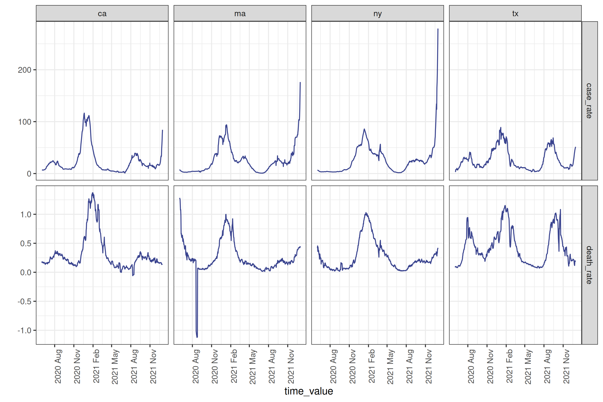

<!-- README.md is generated from README.Rmd. Please edit that file -->

# Epipredict

<!-- badges: start -->

[](https://github.com/cmu-delphi/epipredict/actions/workflows/R-CMD-check.yaml)
<!-- badges: end -->

Epipredict is a framework for building transformation and forecasting
pipelines for epidemiological and other panel time-series datasets. In
addition to tools for building forecasting pipelines, it contains a
number of “canned” forecasters meant to run with little modification as
an easy way to get started forecasting.

It is designed to work well with
[`epiprocess`](https://cmu-delphi.github.io/epiprocess/), a utility for
handling various time series and geographic processing tools in an
epidemiological context. Both of the packages are meant to work well
with the panel data provided by
[`epidatr`](https://cmu-delphi.github.io/epidatr/).

If you are looking for more detail beyond the package documentation, see
our [forecasting
book](https://cmu-delphi.github.io/delphi-tooling-book/).

## Installation

To install (unless you’re planning on contributing to package
development, we suggest using the stable version):

``` r
# Stable version
pak::pkg_install("cmu-delphi/epipredict@main")

# Dev version
pak::pkg_install("cmu-delphi/epipredict@dev")
```

The documentation for the stable version is at
<https://cmu-delphi.github.io/epipredict>, while the development version
is at <https://cmu-delphi.github.io/epipredict/dev>.

## Motivating example

To demonstrate the kind of forecast epipredict can make, say we’re
predicting COVID deaths per 100k for each state on

``` r
forecast_date <- as.Date("2021-08-01")
```

Below the fold, we construct this dataset as an `epiprocess::epi_df`
from JHU data.

<details>
<summary>
Creating the dataset using `{epidatr}` and `{epiprocess}`
</summary>

This dataset can be found in the package as `covid_case_death_rates`; we
demonstrate some of the typically ubiquitous cleaning operations needed
to be able to forecast. First we pull both jhu-csse cases and deaths
from [`{epidatr}`](https://cmu-delphi.github.io/epidatr/) package:

``` r
cases <- pub_covidcast(
  source = "jhu-csse",
  signals = "confirmed_incidence_prop",
  time_type = "day",
  geo_type = "state",
  time_values = epirange(20200601, 20211231),
  geo_values = "*"
) |>
  select(geo_value, time_value, case_rate = value)

deaths <- pub_covidcast(
  source = "jhu-csse",
  signals = "deaths_incidence_prop",
  time_type = "day",
  geo_type = "state",
  time_values = epirange(20200601, 20211231),
  geo_values = "*"
) |>
  select(geo_value, time_value, death_rate = value)
```

Since visualizing the results on every geography is somewhat
overwhelming, we’ll only train on a subset of 5.

``` r
used_locations <- c("ca", "ma", "ny", "tx")
cases_deaths <-
  full_join(cases, deaths, by = c("time_value", "geo_value")) |>
  filter(geo_value %in% used_locations) |>
  as_epi_df(as_of = as.Date("2022-01-01"))
# plotting the data as it was downloaded
cases_deaths |>
  autoplot(
    case_rate,
    death_rate,
    .color_by = "none"
  ) +
  facet_grid(
    rows = vars(.response_name),
    cols = vars(geo_value),
    scale = "free") +
  scale_x_date(date_breaks = "3 months", date_labels = "%Y %b") +
  theme(axis.text.x = element_text(angle = 90, hjust = 1))
```



As with basically any dataset, there is some cleaning that we will need
to do to make it actually usable; we’ll use some utilities from
[`{epiprocess}`](https://cmu-delphi.github.io/epiprocess/) for this.

First, to eliminate some of the noise coming from daily reporting, we do
7 day averaging over a trailing window[^1]:

``` r
cases_deaths <-
  cases_deaths |>
  group_by(geo_value) |>
  epi_slide(
    cases_7dav = mean(case_rate, na.rm = TRUE),
    death_rate_7dav = mean(death_rate, na.rm = TRUE),
    .window_size = 7
  ) |>
  ungroup() |>
  mutate(case_rate = NULL, death_rate = NULL) |>
  rename(case_rate = cases_7dav, death_rate = death_rate_7dav)
```

Then trimming outliers, most especially negative values:

``` r
cases_deaths <-
  cases_deaths |>
  group_by(geo_value) |>
  mutate(
    outlr_death_rate = detect_outlr_rm(
      time_value, death_rate,
      detect_negatives = TRUE
    ),
    outlr_case_rate = detect_outlr_rm(
      time_value, case_rate,
      detect_negatives = TRUE
    )
  ) |>
  unnest(cols = starts_with("outlr"), names_sep = "_") |>
  ungroup() |>
  mutate(
    death_rate = outlr_death_rate_replacement,
    case_rate = outlr_case_rate_replacement
  ) |>
  select(geo_value, time_value, case_rate, death_rate)
```

</details>

After having downloaded and cleaned the data in `cases_deaths`, we plot
a subset of the states, noting the actual forecast date:

<details>
<summary>
Plot
</summary>

``` r
forecast_date_label <-
  tibble(
    geo_value = rep(used_locations, 2),
    .response_name = c(rep("case_rate", 4), rep("death_rate", 4)),
    dates = rep(forecast_date - 7 * 2, 2 * length(used_locations)),
    heights = c(rep(150, 4), rep(0.75, 4))
  )
processed_data_plot <-
  covid_case_death_rates |> filter(geo_value %in% used_locations) |>
  autoplot(
    case_rate,
    death_rate,
    .color_by = "none"
  ) +
  facet_grid(
    rows = vars(.response_name),
    cols = vars(geo_value),
    scale = "free") +
  geom_vline(aes(xintercept = forecast_date)) +
  geom_text(
    data = forecast_date_label,
    aes(x = dates, label = "forecast\ndate", y = heights),
    size = 3, hjust = "right"
  ) +
  scale_x_date(date_breaks = "3 months", date_labels = "%Y %b") +
  theme(axis.text.x = element_text(angle = 90, hjust = 1))
```

</details>


To make a forecast, we will use a “canned” simple auto-regressive
forecaster to predict the death rate four weeks into the future using
lagged[^2] deaths and cases

``` r
four_week_ahead <- arx_forecaster(
  cases_deaths |> filter(time_value <= forecast_date),
  outcome = "death_rate",
  predictors = c("case_rate", "death_rate"),
  args_list = arx_args_list(
    lags = list(c(0, 1, 2, 3, 7, 14), c(0, 7, 14)),
    ahead = 4 * 7,
    quantile_levels = c(0.1, 0.25, 0.5, 0.75, 0.9)
  )
)
four_week_ahead
#> ══ A basic forecaster of type ARX Forecaster ════════════════════════════════
#> 
#> This forecaster was fit on 2025-01-31 10:46:32.
#> 
#> Training data was an <epi_df> with:
#> • Geography: state,
#> • Time type: day,
#> • Using data up-to-date as of: 2022-01-01.
#> • With the last data available on 2021-08-01
#> 
#> ── Predictions ──────────────────────────────────────────────────────────────
#> 
#> A total of 4 predictions are available for
#> • 4 unique geographic regions,
#> • At forecast date: 2021-08-01,
#> • For target date: 2021-08-29,
#> 
```

In this case, we have used 0-3 days, a week, and two week lags for the
case rate, while using only zero, one and two weekly lags for the death
rate (as predictors). The result `four_week_ahead` is both a fitted
model object which could be used any time in the future to create
different forecasts, as well as a set of predicted values (and
prediction intervals) for each location 28 days after the forecast date.
Plotting the prediction intervals on our subset above[^3]:

<details>
<summary>
Plot
</summary>

``` r
epiworkflow <- four_week_ahead$epi_workflow
restricted_predictions <-
  four_week_ahead$predictions |>
  rename(time_value = target_date, value = .pred) |>
  mutate(.response_name = "death_rate")
forecast_plot <-
  four_week_ahead |>
  autoplot(plot_data = cases_deaths) +
  geom_vline(aes(xintercept = forecast_date)) +
  geom_text(
    data = forecast_date_label %>% filter(.response_name == "death_rate"),
    aes(x = dates, label = "forecast\ndate", y = heights),
    size = 3, hjust = "right"
  ) +
  scale_x_date(date_breaks = "3 months", date_labels = "%Y %b") +
  theme(axis.text.x = element_text(angle = 90, hjust = 1))
```

</details>


And as a tibble of quantile level-value pairs:

``` r
four_week_ahead$predictions |>
  select(-.pred) |>
  pivot_quantiles_longer(.pred_distn)
#> # A tibble: 20 × 5
#>   geo_value values quantile_levels forecast_date target_date
#>   <chr>      <dbl>           <dbl> <date>        <date>     
#> 1 ca        0.199             0.1  2021-08-01    2021-08-29 
#> 2 ca        0.285             0.25 2021-08-01    2021-08-29 
#> 3 ca        0.345             0.5  2021-08-01    2021-08-29 
#> 4 ca        0.405             0.75 2021-08-01    2021-08-29 
#> 5 ca        0.491             0.9  2021-08-01    2021-08-29 
#> 6 ma        0.0285            0.1  2021-08-01    2021-08-29 
#> # ℹ 14 more rows
```

The black dot gives the median prediction, while the blue intervals give
the 25-75%, the 10-90%, and 2.5-97.5% inter-quantile ranges[^4]. For
this particular day and these locations, the forecasts are relatively
accurate, with the true data being at least within the 10-90% interval.
A couple of things to note:

1.  Our methods are primarily direct forecasters; this means we don’t
    need to predict 1, 2,…, 27 days ahead to then predict 28 days ahead
2.  All of our existing engines are geo-pooled, meaning the training
    data is shared across geographies. This has the advantage of
    increasing the amount of available training data, with the
    restriction that the data needs to be on comparable scales, such as
    rates.

## Getting Help

If you encounter a bug or have a feature request, feel free to file an
[issue on our github
page](https://github.com/cmu-delphi/epipredict/issues). For other
questions, feel free to reach out to the authors, either via this
[contact
form](https://docs.google.com/forms/d/e/1FAIpQLScqgT1fKZr5VWBfsaSp-DNaN03aV6EoZU4YljIzHJ1Wl_zmtg/viewform),
email, or the Insightnet slack.

[^1]: This makes it so that any given day of the processed time-series
    only depends on the previous week, which means that we avoid leaking
    future values when making a forecast.

[^2]: lagged by 3 in this context meaning using the value from 3 days
    ago.

[^3]: Alternatively, you could call `autoplot(four_week_ahead)` to get
    the full collection of forecasts. This is too busy for the space we
    have for plotting here.

[^4]: Note that these are not the same quantiles that we fit when
    creating `four_week_ahead`. They are extrapolated from those
    quantiles using `extrapolate_quantiles()` (which assumes an
    exponential decay in the tails).
