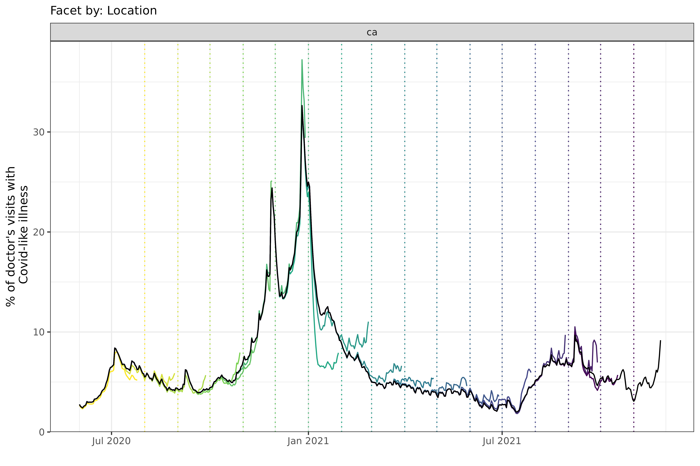
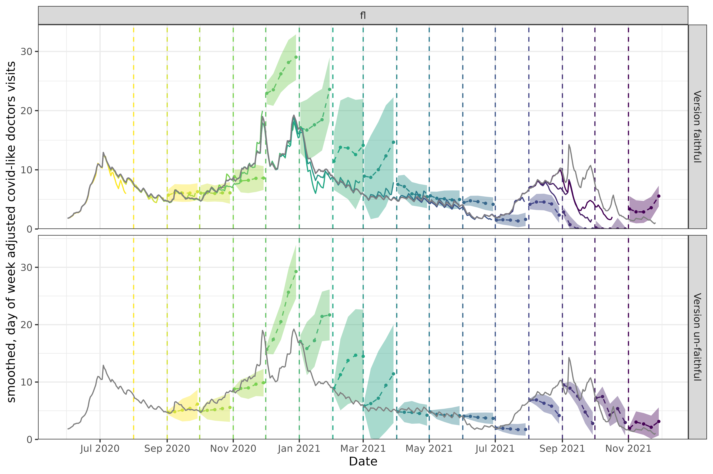
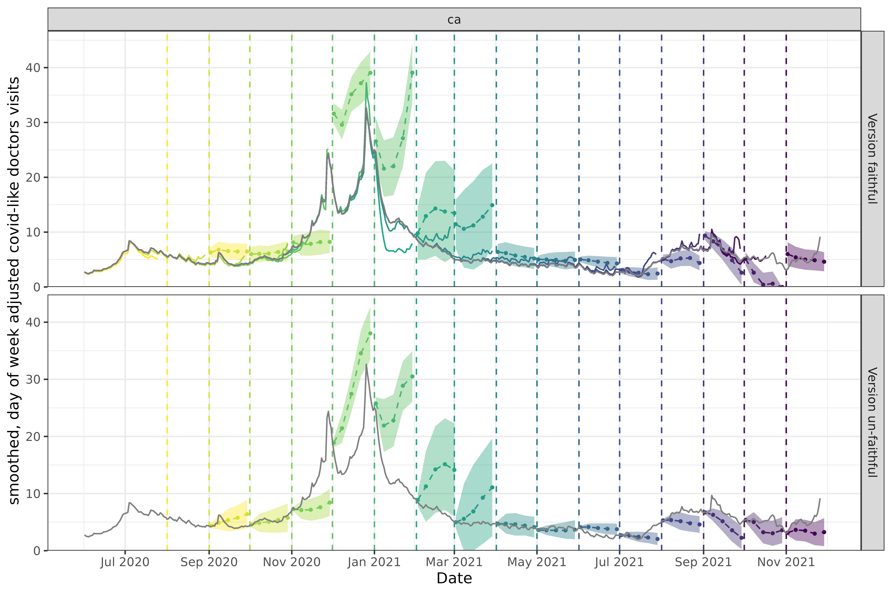

# Accurately backtesting forecasters

Backtesting is a crucial step in the development of forecasting models.
It involves testing the model on historical time periods to see how well
it generalizes to new data.

In the context of epidemiological forecasting, to do backtesting
accurately, we need to account for the fact that the data available at
*the time of the forecast* would have been different from the data
available at the time of the *backtest*. This is because new data is
constantly being collected and added to the dataset, and old data
potentially revised. Training and making predictions only on finalized
data can lead to overly optimistic estimates of accuracy (see, for
example, [McDonald et al. 2021](https://doi.org/10.1073/pnas.2111453118)
and the references therein).

In the [epiprocess](https://github.com/cmu-delphi/epiprocess) package,
we provide the function
[`epix_slide()`](https://cmu-delphi.github.io/epiprocess/reference/epix_slide.html)
to help conviently perform version-faithful forecasting by only using
the data as it would have been available at forecast reference time. In
this vignette, we will demonstrate how to use
[`epix_slide()`](https://cmu-delphi.github.io/epiprocess/reference/epix_slide.html)
to backtest an auto-regressive forecaster constructed using
[`arx_forecaster()`](https://cmu-delphi.github.io/epipredict/reference/arx_forecaster.md)
on historical COVID-19 case data from the US and Canada.

## Getting case data from US states into an `epi_archive`

``` r

# Setup
library(epipredict)
library(epiprocess)
library(epidatr)
library(data.table)
library(dplyr)
library(tidyr)
library(ggplot2)
library(magrittr)
library(purrr)
library(lubridate)
```

First, we create an `epi_archive()` to store the version history of the
percentage of doctor’s visits with CLI (COVID-like illness) computed
from medical insurance claims and the number of new confirmed COVID-19
cases per 100,000 population (daily) for 4 states

``` r

# Select the `percent_cli` column from the data archive
doctor_visits <- archive_cases_dv_subset$DT |>
  select(geo_value, time_value, version, percent_cli) |>
  tidyr::drop_na(percent_cli) |>
  as_epi_archive(compactify = TRUE)
```

The data can also be fetched from the Delphi Epidata API with the
following query:

``` r

library(epidatr)
doctor_visits <- pub_covidcast(
  source = "doctor-visits",
  signals = "smoothed_adj_cli",
  geo_type = "state",
  time_type = "day",
  geo_values = "ca,fl,ny,tx",
  time_values = epirange(20200601, 20211201),
  issues = epirange(20200601, 20211201)
) |>
  # The version date column is called `issue` in the Epidata API. Rename it.
  select(version = issue, geo_value, time_value, percent_cli = value) |>
  as_epi_archive(compactify = TRUE)
```

In the interest of computational speed, we limit the dataset to 4 states
and 2020–2021, but the full archive can be used in the same way and has
performed well in the past.

We choose this dataset in particular partly because it is revision
heavy; for example, here is a plot that compares monthly snapshots of
the data.

Code for plotting

``` r

geo_choose <- "ca"
forecast_dates <- seq(
  from = as.Date("2020-08-01"),
  to = as.Date("2021-11-01"),
  by = "1 month"
)
percent_cli_data <- bind_rows(
  # Snapshotted data for the version-faithful forecasts
  map(
    forecast_dates,
    ~ doctor_visits |>
      epix_as_of(.x) |>
      mutate(version = .x)
  ) |>
    bind_rows() |>
    mutate(version_faithful = "Version faithful"),
  # Latest data for the version-un-faithful forecasts
  doctor_visits |>
    epix_as_of(doctor_visits$versions_end) |>
    mutate(version_faithful = "Version un-faithful")
) |>
  as_tibble()
p0 <- autoplot(
  archive_cases_dv_subset,
  percent_cli,
  .versions = forecast_dates,
  .mark_versions = TRUE,
  .facet_filter = (geo_value == "ca")
) +
  scale_x_date(minor_breaks = "month", date_labels = "%b %Y") +
  labs(x = "", y = "% of doctor's visits with\n Covid-like illness") +
  scale_color_viridis_c(
    option = "viridis",
    guide = guide_legend(reverse = TRUE),
    direction = -1
  ) +
  scale_y_continuous(limits = c(0, NA), expand = expansion(c(0, 0.05))) +
  theme(legend.position = "none")
```



The snapshots are taken on the first of each month, with the vertical
dashed line representing the issue date for the time series of the
corresponding color. For example, the snapshot on March 1st, 2021 is
aquamarine, and increases to slightly over 10. Every series is
necessarily to the left of the snapshot date (since all known values
must happen before the snapshot is taken[^1]). The black line overlaying
the various snapshots represents the “final value”, which is just the
snapshot at the last version in the archive (the `versions_end`).

Comparing with the black line tells us how much the value at the time of
the snapshot differs with what was eventually reported. The drop in
January 2021 in the snapshot on `2021-02-01` was initially reported as
much steeper than it eventually turned out to be, while in the period
after that the values were initially reported as higher than they
actually were.

Handling data latency is important in both real-time forecasting and
retrospective forecasting. Looking at the very first snapshot,
`2020-08-01` (the purple dotted vertical line), there is a noticeable
gap between the forecast date and the end of the red time-series to its
left. In fact, if we take a snapshot and get the last `time_value`,

``` r

doctor_visits |>
  epix_as_of(as.Date("2020-08-01")) |>
  pull(time_value) |>
  max()
#> [1] "2020-07-25"
```

the last day of data is the 25th, a entire week before `2020-08-01`.
This can require some effort to work around, especially if the latency
is variable; see
[`step_adjust_latency()`](https://cmu-delphi.github.io/epipredict/reference/step_adjust_latency.md)
for some methods included in this package. Much of that functionality is
built into
[`arx_forecaster()`](https://cmu-delphi.github.io/epipredict/reference/arx_forecaster.md)
using the parameter `adjust_ahead`, which we will use below.

## Backtesting a simple autoregressive forecaster

In addition to outlier detection and nowcasting, a common use case of
[`epiprocess::epi_archive()`](https://cmu-delphi.github.io/epiprocess/reference/epi_archive.html)
object is for accurate model back-testing.

To start, let’s use a simple autoregressive forecaster to predict
`percent_cli`, the percentage of doctor’s hospital visits associated
with COVID-like illness, 14 days in the future. For increased accuracy
we will use quantile regression.

### Comparing a single day and ahead

As a sanity check before we backtest the *entire* dataset, let’s
forecast a single day in the middle of the dataset. We can do this by
setting the `.versions` argument in
[`epix_slide()`](https://cmu-delphi.github.io/epiprocess/reference/epix_slide.html):

``` r

forecast_date <- as.Date("2021-04-06")
forecasts <- doctor_visits |>
  epix_slide(
    ~ arx_forecaster(
      .x,
      outcome = "percent_cli",
      predictors = "percent_cli",
      args_list = arx_args_list()
    )$predictions |>
      pivot_quantiles_wider(.pred_distn),
    .versions = forecast_date
  )
```

We need truth data to compare our forecast against. We can construct it
by using
[`epix_as_of()`](https://cmu-delphi.github.io/epiprocess/reference/epix_as_of.html)
to snapshot the archive at the last available date[^2].

*Note:* We always want to compare our forecasts to actual (most recently
reported) values because that is the outcome we care about. `as_of` data
is useful for understanding why we’re getting the forecasts we’re
getting, but `as_of` values are only preliminary outcomes. Therefore,
it’s not meaningful to use them for evaluating the performance of a
forecast. Unfortunately, it’s not uncommon for revisions to cause poor
(final) performance of a forecaster that was decent at the time of the
forecast.

``` r

forecasts |>
  inner_join(
    doctor_visits |>
      epix_as_of(doctor_visits$versions_end),
    by = c("geo_value", "target_date" = "time_value")
  ) |>
  select(geo_value, forecast_date, .pred, `0.05`, `0.95`, percent_cli)
#> # A tibble: 4 × 6
#>   geo_value forecast_date .pred `0.05` `0.95` percent_cli
#>   <chr>     <date>        <dbl>  <dbl>  <dbl>       <dbl>
#> 1 ca        2021-04-03     6.79  2.63   11.0         4.06
#> 2 fl        2021-04-03     7.40  3.23   11.6         5.10
#> 3 ny        2021-04-03     8.05  3.88   12.2         6.92
#> 4 tx        2021-04-03     5.00  0.836   9.17        3.25
```

`.pred` corresponds to the point forecast (median), and `0.05` and
`0.95` correspond to the 5th and 95th quantiles. The `percent_cli` truth
data falls within the prediction intervals, so our implementation passes
a simple validation.

### Comparing version faithful and version un-faithful forecasts

Now let’s compare the behavior of this forecaster, both properly
considering data versioning (“version faithful”) and ignoring data
versions (“version un-faithful”).

For the version un-faithful approach, we need to do some setup if we
want to use `epix_slide` for backtesting. We want to simulate a data set
that receives finalized updates every day, that is, a data set with no
revisions. To do this, we will snapshot the latest version of the data
to create a synthetic data set, and convert it into an archive where
`version = time_value`[^3].

``` r

archive_cases_dv_subset_faux <- doctor_visits |>
  epix_as_of(doctor_visits$versions_end) |>
  mutate(version = time_value) |>
  as_epi_archive()
```

For the version faithful approach, we will continue using the original
`epi_archive` object containing all version updates.

We will also create the helper function `forecast_wrapper()` to let us
easily map across aheads.

``` r

forecast_wrapper <- function(
  epi_data,
  aheads,
  outcome,
  predictors,
  process_data = identity
) {
  map(
    aheads,
    \(ahead) {
      arx_forecaster(
        process_data(epi_data),
        outcome,
        predictors,
        args_list = arx_args_list(
          ahead = ahead,
          lags = c(0:7, 14, 21),
          adjust_latency = "extend_ahead"
        )
      )$predictions |>
        pivot_quantiles_wider(.pred_distn)
    }
  ) |>
    bind_rows()
}
```

*Note:* In the helper function, we’re using the parameter
`adjust_latency`. We need to use it because the most recently released
data may still be several days old on any given forecast date (lag \>
0); `adjust_latency` will modify the forecaster to compensate[^4]. See
the function
[`step_adjust_latency()`](https://cmu-delphi.github.io/epipredict/reference/step_adjust_latency.md)
for more details and examples.

Now that we’re set up, we can generate forecasts for both the version
faithful and un-faithful archives, and bind the results together.

``` r

forecast_dates <- seq(
  from = as.Date("2020-09-01"),
  to = as.Date("2021-11-01"),
  by = "1 month"
)
aheads <- c(1, 7, 14, 21, 28)

version_unfaithful <- archive_cases_dv_subset_faux |>
  epix_slide(
    ~ forecast_wrapper(.x, aheads, "percent_cli", "percent_cli"),
    .before = 120,
    .versions = forecast_dates
  ) |>
  mutate(version_faithful = "Version un-faithful")

version_faithful <- doctor_visits |>
  epix_slide(
    ~ forecast_wrapper(.x, aheads, "percent_cli", "percent_cli"),
    .before = 120,
    .versions = forecast_dates
  ) |>
  mutate(version_faithful = "Version faithful")

forecasts <-
  bind_rows(
    version_unfaithful,
    version_faithful
  )
```

[`arx_forecaster()`](https://cmu-delphi.github.io/epipredict/reference/arx_forecaster.md)
does all the heavy lifting. It creates and lags copies of the features
(here, the response and doctors visits), creates and leads copies of the
target while respecting timestamps and locations, fits a forecasting
model using the specified engine, creates predictions, and creates
non-parametric confidence bands.

To see how the version faithful and un-faithful predictions compare,
let’s plot them on top of the latest case rates, using the same
versioned plotting method as above. Note that even though we fit the
model on four states (California, Texas, Florida, and New York), we’ll
just display the results for two states, California (CA) and Florida
(FL), to get a sense of the model performance while keeping the graphic
simpler.

Code for plotting

``` r

geo_choose <- "ca"
forecasts_filtered <- forecasts |>
  filter(geo_value == geo_choose) |>
  mutate(time_value = version)
# we need to add the ground truth data to the version faithful plot as well
plotting_data <- bind_rows(
  percent_cli_data,
  percent_cli_data |>
    filter(version_faithful == "Version un-faithful") |>
    mutate(version = max(percent_cli_data$version)) |>
    mutate(version_faithful = "Version faithful")
)

p1 <- ggplot(
  data = forecasts_filtered,
  aes(x = target_date, group = time_value)
) +
  geom_ribbon(
    aes(ymin = `0.05`, ymax = `0.95`, fill = (time_value)),
    alpha = 0.4
  ) +
  geom_line(aes(y = .pred, color = (time_value)), linetype = 2L) +
  geom_point(aes(y = .pred, color = (time_value)), size = 0.75) +
  # the forecast date
  geom_vline(
    data = percent_cli_data |>
      filter(geo_value == geo_choose) |>
      select(-version_faithful),
    aes(color = version, xintercept = version, group = version),
    lty = 2
  ) +
  # the underlying data
  geom_line(
    data = plotting_data |> filter(geo_value == geo_choose),
    aes(x = time_value, y = percent_cli, color = (version), group = version),
    inherit.aes = FALSE,
    na.rm = TRUE
  ) +
  facet_grid(version_faithful ~ geo_value, scales = "free") +
  scale_x_date(breaks = "2 months", date_labels = "%b %Y") +
  scale_y_continuous(expand = expansion(c(0, 0.05))) +
  labs(
    x = "Date",
    y = "smoothed, day of week adjusted covid-like doctors visits"
  ) +
  scale_color_viridis_c(option = "viridis", direction = -1) +
  scale_fill_viridis_c(option = "viridis", direction = -1) +
  theme(legend.position = "none")
```

``` r

geo_choose <- "fl"
forecasts_filtered <- forecasts |>
  filter(geo_value == geo_choose) |>
  mutate(time_value = version)

forecasts_filtered %>% names
#>  [1] "version"          "geo_value"        ".pred"           
#>  [4] "forecast_date"    "target_date"      "0.05"            
#>  [7] "0.1"              "0.25"             "0.5"             
#> [10] "0.75"             "0.9"              "0.95"            
#> [13] "version_faithful" "time_value"
p2 <-
  ggplot(data = forecasts_filtered, aes(x = target_date, group = time_value)) +
  geom_ribbon(
    aes(ymin = `0.05`, ymax = `0.95`, fill = (time_value)),
    alpha = 0.4
  ) +
  geom_line(aes(y = .pred, color = (time_value)), linetype = 2L) +
  geom_point(aes(y = .pred, color = (time_value)), size = 0.75) +
  # the forecast date
  geom_vline(
    data = percent_cli_data |>
      filter(geo_value == geo_choose) |>
      select(-version_faithful),
    aes(color = version, xintercept = version, group = version),
    lty = 2
  ) +
  # the underlying data
  geom_line(
    data = plotting_data |> filter(geo_value == geo_choose),
    aes(x = time_value, y = percent_cli, color = (version), group = version),
    inherit.aes = FALSE,
    na.rm = TRUE
  ) +
  facet_grid(version_faithful ~ geo_value, scales = "free") +
  scale_x_date(breaks = "2 months", date_labels = "%b %Y") +
  scale_y_continuous(expand = expansion(c(0, 0.05))) +
  labs(
    x = "Date",
    y = "smoothed, day of week adjusted covid-like doctors visits"
  ) +
  scale_color_viridis_c(option = "viridis", direction = -1) +
  scale_fill_viridis_c(option = "viridis", direction = -1) +
  theme(legend.position = "none")
p2
```





There are some weeks when the forecasts are somewhat similar, and others
when they are wildly different, although neither approach produces
amazingly accurate forecasts.

In the version faithful case for California, the March 2021 forecast
(turquoise) starts at a value just above 10, which is very well lined up
with reported values leading up to that forecast. The measured and
forecasted trends are also concordant (both increasingly moderately
fast).

Because the data for this time period was later adjusted down with a
decreasing trend, the March 2021 forecast looks quite bad compared to
finalized data. The equivalent version un-faithful forecast starts at a
value of 5, which is in line with the finalized data but would have been
out of place compared to the version data.

The October 2021 forecast for the version faithful case floors out at
zero, whereas the un-faithful is much closer to the finalized data.


Now let’s look at Florida. In the version faithful case, the three
late-2021 forecasts (purples and pinks) starting in September predict
very low values, near 0. The trend leading up to each forecast shows a
substantial decrease, so these forecasts seem appropriate and we would
expect them to score fairly well on various performance metrics when
compared to the versioned data.

However in hindsight, we know that early versions of the data
systematically under-reported COVID-related doctor visits such that
these forecasts don’t actually perform well compared to *finalized*
data. In this example, version faithful forecasts predicted values at or
near 0 while finalized data shows values in the 5-10 range. As a result,
the version un-faithful forecasts for these same dates are quite a bit
higher, and would perform well when scored using the finalized data and
poorly with versioned data.

In general, the longer ago a forecast was made, the worse its
performance is compared to finalized data. Finalized data accumulates
revisions over time that make it deviate more and more from the
non-finalized data a model was trained on. Forecasts *trained* on
finalized data will of course appear to perform better when *scored* on
finalized data, but will have unknown performance on the non-finalized
data we need to use if we want timely predictions.

Without using data that would have been available on the actual forecast
date, you have little insight into what level of performance you can
expect in practice.

Good performance of a version un-faithful model is a mirage; it is only
achievable if the training data has no revisions. If a data source has
any revisions, version un-faithful-level performance is unachievable
when making forecasts in real time.

[^1]: Until we have a time machine

[^2]: For forecasting a single day like this, we could have actually
    just used `doctor_visits |> epix_as_of(forecast_date)` to get the
    relevant snapshot, and then fed that into
    [`arx_forecaster()`](https://cmu-delphi.github.io/epipredict/reference/arx_forecaster.md)
    as we did in the [landing
    page](https://cmu-delphi.github.io/epipredict/index.html#motivating-example).

[^3]: Generally we advise against this; the only time to consider faking
    versioning like this are if you’re back-testing data with no
    versions available at all, or if you’re doing an explicit comparison
    like this. If you have no versions you should assume performance is
    worse than what the test would otherwise suggest.

[^4]: In this case by adjusting the length of the ahead so that it is
    actually forecasting from the last day of data (e.g. for 2 day
    latent data and a true ahead of 5, the `extended_ahead` would
    actually be 7)
