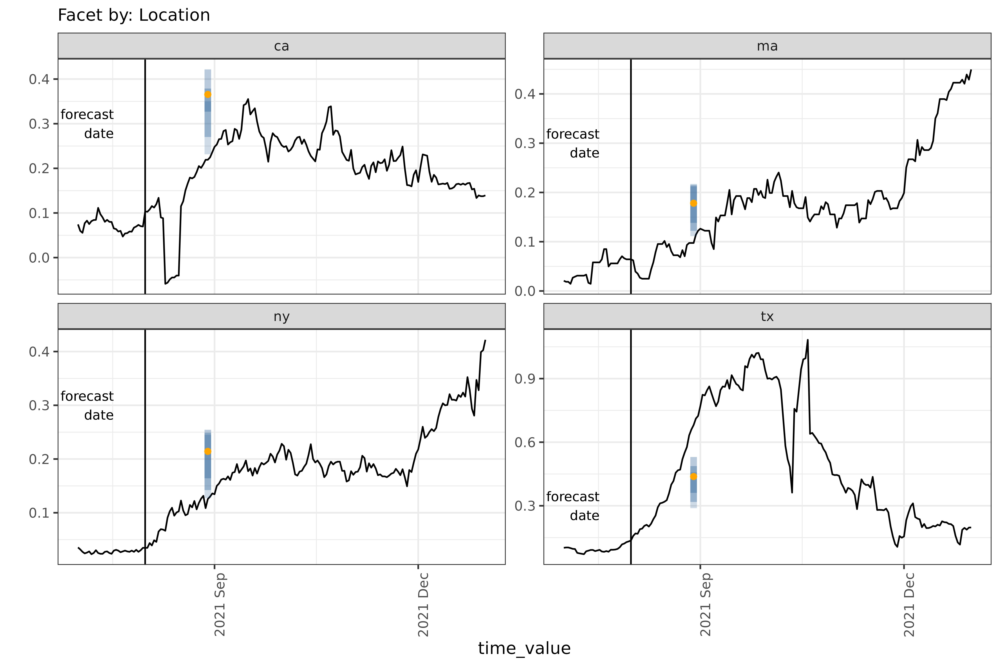

# Custom Epiworkflows

If you want to do custom data preprocessing or fit a model that isn’t
included in the canned workflows, you’ll need to write a custom
[`epi_workflow()`](https://cmu-delphi.github.io/epipredict/dev/reference/epi_workflow.md).
An
[`epi_workflow()`](https://cmu-delphi.github.io/epipredict/dev/reference/epi_workflow.md)
is a sub-class of a
[`workflows::workflow()`](https://workflows.tidymodels.org/reference/workflow.html)
from the [workflows](https://github.com/tidymodels/workflows) package
designed to handle panel data specifically.

To understand how to work with custom
[`epi_workflow()`](https://cmu-delphi.github.io/epipredict/dev/reference/epi_workflow.md)s,
let’s recreate and then modify the `four_week_ahead` example from the
[landing
page](https://cmu-delphi.github.io/epipredict/dev/index.html#motivating-example).
Let’s first remind ourselves how to use a simple canned workflow:

``` r

training_data <- covid_case_death_rates |>
  filter(time_value <= forecast_date, geo_value %in% used_locations)
four_week_ahead <- arx_forecaster(
  training_data,
  outcome = "death_rate",
  predictors = c("case_rate", "death_rate"),
  args_list = arx_args_list(
    lags = list(c(0, 1, 2, 3, 7, 14), c(0, 7, 14)),
    ahead = 4 * 7,
    quantile_levels = c(0.1, 0.25, 0.5, 0.75, 0.9)
  )
)
four_week_ahead$epi_workflow
#> 
#> ══ Epi Workflow [trained] ═══════════════════════════════════════════════════
#> Preprocessor: Recipe
#> Model: linear_reg()
#> Postprocessor: Frosting
#> 
#> ── Preprocessor ─────────────────────────────────────────────────────────────
#> 
#> 7 Recipe steps.
#> 1. step_epi_lag()
#> 2. step_epi_lag()
#> 3. step_epi_ahead()
#> 4. step_naomit()
#> 5. step_naomit()
#> 6. step_training_window()
#> 7. check_enough_data()
#> 
#> ── Model ────────────────────────────────────────────────────────────────────
#> 
#> Call:
#> stats::lm(formula = ..y ~ ., data = data)
#> 
#> Coefficients:
#>       (Intercept)    lag_0_case_rate    lag_1_case_rate    lag_2_case_rate  
#>        -0.0060191          0.0004648          0.0021793          0.0004928  
#>   lag_3_case_rate    lag_7_case_rate   lag_14_case_rate   lag_0_death_rate  
#>         0.0007806         -0.0021676          0.0018002          0.4258788  
#>  lag_7_death_rate  lag_14_death_rate  
#>         0.1632748         -0.1584456
#> 
#> ── Postprocessor ────────────────────────────────────────────────────────────
#> 
#> 5 Frosting layers.
#> 1. layer_predict()
#> 2. layer_residual_quantiles()
#> 3. layer_add_forecast_date()
#> 4. layer_add_target_date()
#> 5. layer_threshold()
#> 
```

## Anatomy of an `epi_workflow`

An
[`epi_workflow()`](https://cmu-delphi.github.io/epipredict/dev/reference/epi_workflow.md)
is an extension of a
[`workflows::workflow()`](https://workflows.tidymodels.org/reference/workflow.html)
that is specially designed to handle panel data, and to apply custom
post-processing steps to the output of a model. All `epi_workflows`,
including simple and canned workflows, consist of 3 components, a
preprocessor, trainer, and postprocessor.

#### Preprocessor

A preprocessor (in the context of epipredict this means a `{recipe}`)
transforms the data before model training and prediction.
Transformations can include converting counts to rates, applying a
running average to columns, or [any of the `step`s found in
`{recipes}`](https://recipes.tidymodels.org/reference/index.html).

All workflows must include a preprocessor. The most basic preprocessor
just assigns roles to columns, telling the model in the next step which
to use as predictors or the outcome.

However, preprocessors can do much more. You can think of a preprocessor
as a more flexible `formula` that you would pass to
[`lm()`](https://rdrr.io/r/stats/lm.html):
`y ~ x1 + log(x2) + lag(x1, 5)`. The simple model above internally runs
6 of these steps, such as creating lagged predictor columns.

In general, there are 2 broad classes of transformation that
[recipes](https://github.com/tidymodels/recipes) `step`s handle:

- Operations that are applied to both training and test data without
  using stored information. Examples include taking the log of a
  variable, leading or lagging columns, filtering out rows, handling
  dummy variables, calculating growth rates, etc.
- Operations that rely on stored information (parameters estimated
  during training) to modify both train and test data. Examples include
  centering by the mean, and normalizing the variance to be one
  (whitening).

We differentiate between these types of transformations because the
second type can result in information leakage if not done properly.
Information leakage or data leakage happens when a system has access to
information that would not have been available at prediction time and
could change our evaluation of the model’s real-world performance.

In the case of centering, we need to store the mean of the predictor
from the training data and use that value on the prediction data, rather
than using the mean of the test predictor for centering or including
test data in the mean calculation.

A major benefit of [recipes](https://github.com/tidymodels/recipes) is
that it prevents information leakage. However, the *main* mechanism we
rely on to prevent data leakage in the context of epidemiological
forecasting is proper
[backtesting](https://cmu-delphi.github.io/epipredict/dev/articles/backtesting.md).

#### Trainer

A trainer (aso called a model or engine) fits a
[parsnip](https://github.com/tidymodels/parsnip) model to training data,
and outputs a fitted model object. Examples include linear regression,
quantile regression, or [any `{parsnip}`
engine](https://www.tidymodels.org/find/parsnip/). The
[parsnip](https://github.com/tidymodels/parsnip) front-end abstracts
away the differences in interface between a wide collection of
statistical models.

All workflows must include a model.

#### Postprocessor

Generally a postprocessor modifies and formats the prediction after a
model has been fit. An
[epipredict](https://github.com/cmu-delphi/epipredict/) postprocessor is
called a
[`frosting()`](https://cmu-delphi.github.io/epipredict/dev/reference/frosting.md);
there are alternatives such as [tailor](https://tailor.tidymodels.org/)
which performs calibration.

The postprocessor is *optional*. It only needs to be included in a
workflow if you need to process the model output.

Each operation within a postprocessor is called a “layer” (functions are
named `layer_*`), and the stack of layers is known as
[`frosting()`](https://cmu-delphi.github.io/epipredict/dev/reference/frosting.md),
continuing the metaphor of baking a cake established in
[recipes](https://github.com/tidymodels/recipes). Some example
operations include:

- generating quantiles from purely point-prediction models
- reverting transformations done in prior steps, such as converting from
  rates back to counts
- thresholding forecasts to remove negative values
- generally adapting the format of the prediction to a downstream use.

## Recreating `four_week_ahead` in an `epi_workflow()`

To understand how to create custom workflows, let’s first recreate the
simple canned
[`arx_forecaster()`](https://cmu-delphi.github.io/epipredict/dev/reference/arx_forecaster.md)
from scratch.

We’ll think through the following sub-steps:

1.  Define the
    [`epi_recipe()`](https://cmu-delphi.github.io/epipredict/dev/reference/epi_recipe.md),
    which contains the preprocessing steps
2.  Define the
    [`frosting()`](https://cmu-delphi.github.io/epipredict/dev/reference/frosting.md)
    which contains the post-processing layers
3.  Combine these with a trainer such as
    [`quantile_reg()`](https://cmu-delphi.github.io/epipredict/dev/reference/quantile_reg.md)
    into an
    [`epi_workflow()`](https://cmu-delphi.github.io/epipredict/dev/reference/epi_workflow.md),
    which we can then fit on the training data
4.  [`fit()`](https://generics.r-lib.org/reference/fit.html) the
    workflow on some data
5.  Grab the right prediction data using
    [`get_test_data()`](https://cmu-delphi.github.io/epipredict/dev/reference/get_test_data.md)
    and apply the fit data to generate a prediction

### Define the `epi_recipe()`

The steps found in `four_week_ahead` look like:

``` r

hardhat::extract_recipe(four_week_ahead$epi_workflow)
#> 
#> ── Epi Recipe ───────────────────────────────────────────────────────────────
#> 
#> ── Inputs
#> Number of variables by role
#> raw:        2
#> geo_value:  1
#> time_value: 1
#> 
#> ── Training information
#> Training data contained 856 data points and no incomplete rows.
#> 
#> ── Operations
#> 1. Lagging: case_rate by 0, 1, 2, 3, 7, 14 | Trained
#> 2. Lagging: death_rate by 0, 7, 14 | Trained
#> 3. Leading: death_rate by 28 | Trained
#> 4. • Removing rows with NA values in: lag_0_case_rate, ... | Trained
#> 5. • Removing rows with NA values in: ahead_28_death_rate | Trained
#> 6. • # of recent observations per key limited to:: Inf | Trained
#> 7. • Check enough data (n = 1) for: lag_0_case_rate, ... | Trained
```

There are 6 steps we will need to recreate. Note that all steps in the
extracted recipe are marked as already having been `Trained`. For steps
such as
[`recipes::step_BoxCox()`](https://recipes.tidymodels.org/reference/step_BoxCox.html)
that have parameters that change their behavior, this means that their
parameters have already been calculated based on the training data set.

Let’s create an
[`epi_recipe()`](https://cmu-delphi.github.io/epipredict/dev/reference/epi_recipe.md)
to hold the 6 steps:

``` r

filtered_data <- covid_case_death_rates |>
  filter(time_value <= forecast_date, geo_value %in% used_locations)
four_week_recipe <- epi_recipe(
  filtered_data,
  reference_date = (filtered_data %@% metadata)$as_of
)
```

The data set passed to `epi_recipe` isn’t required to be the actual data
set on which you are going to train the model. However, it should have
the same columns and the same metadata (such as `as_of` and
`other_keys`); it is typically easiest just to use the training data
itself.

This means that you can use the same workflow for multiple data sets as
long as the format remains the same. This might be useful if you
continue to get updates to a data set over time and you want to train a
new instance of the same model.

Then we can append each `step` using pipes. In principle, the order
matters, though for this recipe only
[`step_epi_naomit()`](https://cmu-delphi.github.io/epipredict/dev/reference/step_epi_naomit.md)
and
[`step_training_window()`](https://cmu-delphi.github.io/epipredict/dev/reference/step_training_window.md)
depend on the steps before them. The other steps can be thought of as
setting parameters that help specify later processing and computation.

``` r

four_week_recipe <- four_week_recipe |>
  step_epi_lag(case_rate, lag = c(0, 1, 2, 3, 7, 14)) |>
  step_epi_lag(death_rate, lag = c(0, 7, 14)) |>
  step_epi_ahead(death_rate, ahead = 4 * 7) |>
  step_epi_naomit() |>
  step_training_window()
```

Note we said before that `four_week_ahead` contained 6 steps. We’ve only
added *5* top-level steps here because
[`step_epi_naomit()`](https://cmu-delphi.github.io/epipredict/dev/reference/step_epi_naomit.md)
is actually a wrapper around adding two
[`step_naomit()`](https://recipes.tidymodels.org/reference/step_naomit.html)s,
one for
[`all_predictors()`](https://recipes.tidymodels.org/reference/has_role.html)
and one for
[`all_outcomes()`](https://recipes.tidymodels.org/reference/has_role.html).
The
[`step_naomit()`](https://recipes.tidymodels.org/reference/step_naomit.html)s
differ in their treatment of the data at predict time.

[`step_epi_lag()`](https://cmu-delphi.github.io/epipredict/dev/reference/step_epi_shift.md)
and
[`step_epi_ahead()`](https://cmu-delphi.github.io/epipredict/dev/reference/step_epi_shift.md)
both accept [“tidy”
syntax](https://dplyr.tidyverse.org/reference/select.html) so processing
can be applied to multiple columns at once. For example, if we wanted to
use the same lags for both `case_rate` and `death_rate`, we could
specify them in a single step, like
`step_epi_lag(ends_with("rate"), lag = c(0, 7, 14))`.

In general, [recipes](https://github.com/tidymodels/recipes) `step`s
assign roles (such as `predictor`, or `outcome`, see the [Roles vignette
for details](https://recipes.tidymodels.org/articles/Roles.html)) to
columns either by adding new columns or adjusting existing ones.
[`step_epi_lag()`](https://cmu-delphi.github.io/epipredict/dev/reference/step_epi_shift.md),
for example, creates a new column for each lag with the name
`lag_x_column_name` and labels them each with the `predictor` role.
[`step_epi_ahead()`](https://cmu-delphi.github.io/epipredict/dev/reference/step_epi_shift.md)
creates `ahead_x_column_name` columns and labels each with the `outcome`
role.

In general, to inspect the ‘prepared’ steps, we can run
[`prep()`](https://recipes.tidymodels.org/reference/prep.html), which
fits any parameters used in the recipe, calculates new columns, and
assigns roles[^1]. For example, we can use
[`prep()`](https://recipes.tidymodels.org/reference/prep.html) to make
sure that we are training on the correct columns:

``` r

prepped <- four_week_recipe |> prep(training_data)
prepped$term_info |> print(n = 14)
#> # A tibble: 14 × 4
#>    variable            type    role       source  
#>    <chr>               <chr>   <chr>      <chr>   
#>  1 geo_value           nominal geo_value  original
#>  2 time_value          date    time_value original
#>  3 case_rate           numeric raw        original
#>  4 death_rate          numeric raw        original
#>  5 lag_0_case_rate     numeric predictor  derived 
#>  6 lag_1_case_rate     numeric predictor  derived 
#>  7 lag_2_case_rate     numeric predictor  derived 
#>  8 lag_3_case_rate     numeric predictor  derived 
#>  9 lag_7_case_rate     numeric predictor  derived 
#> 10 lag_14_case_rate    numeric predictor  derived 
#> 11 lag_0_death_rate    numeric predictor  derived 
#> 12 lag_7_death_rate    numeric predictor  derived 
#> 13 lag_14_death_rate   numeric predictor  derived 
#> 14 ahead_28_death_rate numeric outcome    derived
```

[`bake()`](https://recipes.tidymodels.org/reference/bake.html) applies a
prepared recipe to a (potentially new) dataset to create the dataset as
handed to the
[`epi_workflow()`](https://cmu-delphi.github.io/epipredict/dev/reference/epi_workflow.md).
We can inspect newly-created columns by running
[`bake()`](https://recipes.tidymodels.org/reference/bake.html) on the
recipe so far:

``` r

four_week_recipe |>
  prep(training_data) |>
  bake(training_data)
#> An `epi_df` object, 800 x 14 with metadata:
#> * geo_type  = state
#> * time_type = day
#> * as_of     = 2023-03-10
#> Latency (time between last available observation and epi_df's as_of, by time series):
#> * latency across all time series = 586–614 days (see summary() for per-signal details)
#> 
#> # A tibble: 800 × 14
#>   geo_value time_value case_rate death_rate lag_0_case_rate lag_1_case_rate
#> * <chr>     <date>         <dbl>      <dbl>           <dbl>           <dbl>
#> 1 ca        2021-01-14     108.       1.22            108.            111. 
#> 2 ma        2021-01-14      88.7      0.893            88.7            92.0
#> 3 ny        2021-01-14      82.4      0.969            82.4            84.9
#> 4 tx        2021-01-14      74.9      1.05             74.9            75.0
#> 5 ca        2021-01-15     104.       1.21            104.            108. 
#> 6 ma        2021-01-15      83.3      0.908            83.3            88.7
#> # ℹ 794 more rows
#> # ℹ 8 more variables: lag_2_case_rate <dbl>, lag_3_case_rate <dbl>, …
```

This is also useful for debugging malfunctioning pipelines. You can run
[`prep()`](https://recipes.tidymodels.org/reference/prep.html) and
[`bake()`](https://recipes.tidymodels.org/reference/bake.html) on a new
recipe containing a subset of `step`s – all `step`s from the beginning
up to the one that is misbehaving – from the full, original recipe. This
will return an evaluation of the `recipe` up to that point so that you
can see the data that the misbehaving `step` is being applied to. It
also allows you to see the exact data that a later
[parsnip](https://github.com/tidymodels/parsnip) model is trained on.

### Define the `frosting()`

The post-processing `frosting` layers[^2] found in `four_week_ahead`
look like:

``` r

epipredict::extract_frosting(four_week_ahead$epi_workflow)
#> 
#> ── Frosting ─────────────────────────────────────────────────────────────────
#> 
#> ── Layers
#> 1. Creating predictions: "<calculated>"
#> 2. Resampling residuals for predictive quantiles: "<calculated>"
#> 3. quantile_levels 0.1, 0.25, 0.5, 0.75, 0.9
#> 4. Adding forecast date: "2021-08-01"
#> 5. Adding target date: "2021-08-29"
#> 6. Thresholding predictions: dplyr::starts_with(".pred") to [0, Inf)
```

*Note*: since `frosting` is unique to this package, we’ve defined a
custom function
[`extract_frosting()`](https://cmu-delphi.github.io/epipredict/dev/reference/extract_frosting.md)
to inspect these steps.

Using the detailed information in the output above, we can recreate the
layers similar to how we defined the `recipe` `step`s[^3]:

``` r

four_week_layers <- frosting() |>
  layer_predict() |>
  layer_residual_quantiles(quantile_levels = c(0.1, 0.25, 0.5, 0.75, 0.9)) |>
  layer_add_forecast_date() |>
  layer_add_target_date() |>
  layer_threshold()
```

[`layer_predict()`](https://cmu-delphi.github.io/epipredict/dev/reference/layer_predict.md)
needs to be included in every postprocessor to actually predict on the
prediction data.

Most layers work with any engine or `step`s. There are a couple of
layers, however, that depend on whether the engine predicts quantiles or
point estimates.

The following layers are only supported by point estimate engines, such
as
[`linear_reg()`](https://parsnip.tidymodels.org/reference/linear_reg.html):

- [`layer_residual_quantiles()`](https://cmu-delphi.github.io/epipredict/dev/reference/layer_residual_quantiles.md):
  for models that don’t generate quantiles, the preferred method of
  generating quantiles. This function uses the error residuals of the
  engine to calculate quantiles. This will work for most
  [parsnip](https://github.com/tidymodels/parsnip) engines.
- [`layer_predictive_distn()`](https://cmu-delphi.github.io/epipredict/dev/reference/layer_predictive_distn.md):
  alternate method of generating quantiles using an approximate
  parametric distribution. This will work for linear regression
  specifically.

On the other hand, the following layers are only supported by engines
that output quantiles, such as
[`quantile_reg()`](https://cmu-delphi.github.io/epipredict/dev/reference/quantile_reg.md):

- [`layer_quantile_distn()`](https://cmu-delphi.github.io/epipredict/dev/reference/layer_quantile_distn.md):
  adds the specified quantiles. If the user-requested quantile levels
  differ from the ones actually fit, they will be interpolated and/or
  extrapolated.
- [`layer_point_from_distn()`](https://cmu-delphi.github.io/epipredict/dev/reference/layer_point_from_distn.md):
  this generates a point estimate from a distribution (either median or
  mean), and, if used, should be included after
  [`layer_quantile_distn()`](https://cmu-delphi.github.io/epipredict/dev/reference/layer_quantile_distn.md).

### Fitting an `epi_workflow()`

Now that we have a recipe and some layers, we can assemble the workflow.
This is as simple as passing the component preprocessor, model, and
postprocessor into
[`epi_workflow()`](https://cmu-delphi.github.io/epipredict/dev/reference/epi_workflow.md).

``` r

four_week_workflow <- epi_workflow(
  four_week_recipe,
  linear_reg(),
  four_week_layers
)
```

After fitting it, we will have recreated `four_week_ahead$epi_workflow`.

``` r

fit_workflow <- four_week_workflow |> fit(training_data)
```

Running [`fit()`](https://generics.r-lib.org/reference/fit.html)
calculates all preprocessor-required parameters, and trains the model on
the data passed in
[`fit()`](https://generics.r-lib.org/reference/fit.html). However, it
does not generate any predictions; predictions need to be created in a
separate step.

### Predicting

To make a prediction, it helps to narrow the data set down to the
relevant observations using
[`get_test_data()`](https://cmu-delphi.github.io/epipredict/dev/reference/get_test_data.md).
We can still generate predictions without doing this first, but it will
predict on *every* day in the data-set, and not just on the
`reference_date`.

``` r

relevant_data <- get_test_data(
  four_week_recipe,
  training_data
)
```

In this example, we’re creating `relevant_data` from `training_data`,
but the data set we want predictions for could be entirely new data,
unrelated to the one we used when building the workflow.

With a trained workflow and data in hand, we can actually make our
predictions:

``` r

fit_workflow |> predict(relevant_data)
#> An `epi_df` object, 4 x 6 with metadata:
#> * geo_type  = state
#> * time_type = day
#> * as_of     = 2023-03-10
#> Latency (time between last available observation and epi_df's as_of, by time series):
#> * latency  = 586 days
#> 
#> # A tibble: 4 × 6
#>   geo_value time_value .pred .pred_distn forecast_date target_date
#>   <chr>     <date>     <dbl>   <qtls(5)> <date>        <date>     
#> 1 ca        2021-08-01 0.341     [0.341] 2021-08-01    2021-08-29 
#> 2 ma        2021-08-01 0.163     [0.163] 2021-08-01    2021-08-29 
#> 3 ny        2021-08-01 0.196     [0.196] 2021-08-01    2021-08-29 
#> 4 tx        2021-08-01 0.404     [0.404] 2021-08-01    2021-08-29
```

Note that if we simply plug the full `training_data` into
[`predict()`](https://rdrr.io/r/stats/predict.html) we will still get
predictions:

``` r

fit_workflow |> predict(training_data)
#> An `epi_df` object, 800 x 6 with metadata:
#> * geo_type  = state
#> * time_type = day
#> * as_of     = 2023-03-10
#> Latency (time between last available observation and epi_df's as_of, by time series):
#> * latency  = 586 days
#> 
#> # A tibble: 800 × 6
#>   geo_value time_value .pred .pred_distn forecast_date target_date
#>   <chr>     <date>     <dbl>   <qtls(5)> <date>        <date>     
#> 1 ca        2021-01-14 0.997     [0.997] 2021-08-01    2021-08-29 
#> 2 ma        2021-01-14 0.835     [0.835] 2021-08-01    2021-08-29 
#> 3 ny        2021-01-14 0.868     [0.868] 2021-08-01    2021-08-29 
#> 4 tx        2021-01-14 0.581     [0.581] 2021-08-01    2021-08-29 
#> 5 ca        2021-01-15 0.869     [0.869] 2021-08-01    2021-08-29 
#> 6 ma        2021-01-15 0.830      [0.83] 2021-08-01    2021-08-29 
#> # ℹ 794 more rows
```

The resulting tibble is 800 rows long, however. Passing the
non-subsetted data set produces forecasts for not just the requested
`reference_date`, but for every day in the data set that has sufficient
data to produce a prediction. To narrow this down, we could filter to
rows where the `time_value` matches the `forecast_date`:

``` r

fit_workflow |>
  predict(training_data) |>
  filter(time_value == forecast_date)
#> An `epi_df` object, 4 x 6 with metadata:
#> * geo_type  = state
#> * time_type = day
#> * as_of     = 2023-03-10
#> Latency (time between last available observation and epi_df's as_of, by time series):
#> * latency  = 586 days
#> 
#> # A tibble: 4 × 6
#>   geo_value time_value .pred .pred_distn forecast_date target_date
#>   <chr>     <date>     <dbl>   <qtls(5)> <date>        <date>     
#> 1 ca        2021-08-01 0.341     [0.341] 2021-08-01    2021-08-29 
#> 2 ma        2021-08-01 0.163     [0.163] 2021-08-01    2021-08-29 
#> 3 ny        2021-08-01 0.196     [0.196] 2021-08-01    2021-08-29 
#> 4 tx        2021-08-01 0.404     [0.404] 2021-08-01    2021-08-29
```

This can be useful as a workaround when
[`get_test_data()`](https://cmu-delphi.github.io/epipredict/dev/reference/get_test_data.md)
fails to pull enough data to produce a forecast. This is generally a
problem when the recipe (preprocessor) is sufficiently complicated, and
[`get_test_data()`](https://cmu-delphi.github.io/epipredict/dev/reference/get_test_data.md)
can’t determine precisely what data is required. The forecasts generated
with `filter` and `get_test_data` are identical.

## Extending `four_week_ahead`

Now that we know how to create `four_week_ahead` from scratch, we can
start modifying the workflow to get custom behavior.

There are many ways we could modify `four_week_ahead`. We might
consider:

- Converting from rates to counts
- Including a growth rate estimate as a predictor
- Including a time component as a predictor — useful if we expect there
  to be a strong seasonal component to the outcome
- Scaling by a factor

We will demonstrate a couple of these modifications below.

### Growth rate

Let’s say we’re interested in including growth rate as a predictor in
our model because we think it may potentially improve our forecast. We
can easily create a new growth rate column as a step in the
`epi_recipe`.

``` r

growth_rate_recipe <- epi_recipe(
  covid_case_death_rates |>
    filter(time_value <= forecast_date, geo_value %in% used_locations)
) |>
  # Calculate growth rate from death rate column.
  step_growth_rate(death_rate) |>
  step_epi_lag(case_rate, lag = c(0, 1, 2, 3, 7, 14)) |>
  step_epi_lag(death_rate, lag = c(0, 7, 14)) |>
  step_epi_ahead(death_rate, ahead = 4 * 7) |>
  step_epi_naomit() |>
  step_training_window()
```

Inspecting the newly added column:

``` r

growth_rate_recipe |>
  prep(training_data) |>
  bake(training_data) |>
  select(
    geo_value, time_value, case_rate,
    death_rate, gr_7_rel_change_death_rate
  ) |>
  arrange(geo_value, time_value) |>
  tail()
#> An `epi_df` object, 6 x 5 with metadata:
#> * geo_type  = state
#> * time_type = day
#> * as_of     = 2023-03-10
#> Latency (time between last available observation and epi_df's as_of, by time series):
#> * latency across all time series = 586 days
#> 
#> # A tibble: 6 × 5
#>   geo_value time_value case_rate death_rate gr_7_rel_change_death_rate
#>   <chr>     <date>         <dbl>      <dbl>                      <dbl>
#> 1 tx        2021-07-27      19.8      0.104                    0.00721
#> 2 tx        2021-07-28      23.6      0.118                    0.0159 
#> 3 tx        2021-07-29      23.4      0.122                    0.0272 
#> 4 tx        2021-07-30      27.6      0.128                    0.0339 
#> 5 tx        2021-07-31      30.7      0.132                    0.0421 
#> 6 tx        2021-08-01      30.7      0.136                    0.0516
```

And the role:

``` r

prepped <- growth_rate_recipe |>
  prep(training_data)
prepped$term_info |> filter(grepl("gr", variable))
#> # A tibble: 1 × 4
#>   variable                   type    role      source 
#>   <chr>                      <chr>   <chr>     <chr>  
#> 1 gr_7_rel_change_death_rate numeric predictor derived
```

Let’s say we want to use
[`quantile_reg()`](https://cmu-delphi.github.io/epipredict/dev/reference/quantile_reg.md)
as the model. Because
[`quantile_reg()`](https://cmu-delphi.github.io/epipredict/dev/reference/quantile_reg.md)
outputs quantiles only, we need to change our `frosting` to convert a
quantile distribution into quantiles and point predictions. To do that,
we need to switch out
[`layer_residual_quantiles()`](https://cmu-delphi.github.io/epipredict/dev/reference/layer_residual_quantiles.md)
(used for converting point + residuals output, e.g. from
[`linear_reg()`](https://parsnip.tidymodels.org/reference/linear_reg.html)
into quantiles) for
[`layer_quantile_distn()`](https://cmu-delphi.github.io/epipredict/dev/reference/layer_quantile_distn.md)
and
[`layer_point_from_distn()`](https://cmu-delphi.github.io/epipredict/dev/reference/layer_point_from_distn.md):

``` r

growth_rate_layers <- frosting() |>
  layer_predict() |>
  layer_quantile_distn(
    quantile_levels = c(0.1, 0.25, 0.5, 0.75, 0.9)
  ) |>
  layer_point_from_distn() |>
  layer_add_forecast_date() |>
  layer_add_target_date() |>
  layer_threshold()

growth_rate_workflow <- epi_workflow(
  growth_rate_recipe,
  quantile_reg(quantile_levels = c(0.1, 0.25, 0.5, 0.75, 0.9)),
  growth_rate_layers
)

relevant_data <- get_test_data(
  growth_rate_recipe,
  training_data
)
gr_fit_workflow <- growth_rate_workflow |> fit(training_data)
gr_predictions <- gr_fit_workflow |>
  predict(relevant_data) |>
  filter(time_value == forecast_date)
```

Plot

We’ll reuse some code from the landing page to plot the result.

``` r

forecast_date_label <-
  tibble(
    geo_value = rep(used_locations, 2),
    .response_name = c(rep("case_rate", 4), rep("death_rate", 4)),
    dates = rep(forecast_date - 7 * 2, 2 * length(used_locations)),
    heights = c(rep(150, 4), rep(0.30, 4))
  )

result_plot <- autoplot(
  object = gr_fit_workflow,
  predictions = gr_predictions,
  observed_response = covid_case_death_rates |>
    filter(geo_value %in% used_locations, time_value > "2021-07-01")
) +
  geom_vline(aes(xintercept = forecast_date)) +
  geom_text(
    data = forecast_date_label |> filter(.response_name == "death_rate"),
    aes(x = dates, label = "forecast\ndate", y = heights),
    size = 3, hjust = "right"
  ) +
  scale_x_date(date_breaks = "3 months", date_labels = "%Y %b") +
  theme(axis.text.x = element_text(angle = 90, hjust = 1))
```



### Population scaling

Suppose we want to modify our predictions to return a rate prediction,
rather than the count prediction. To do that, we can adjust *just* the
`frosting` to perform post-processing on our existing rates forecaster.
Since rates are calculated as counts per 100 000 people, we will convert
back to counts by multiplying rates by the factor
$`\frac{ \text{regional population} }{100,000}`$.

``` r

count_layers <-
  frosting() |>
  layer_predict() |>
  layer_residual_quantiles(quantile_levels = c(0.1, 0.25, 0.5, 0.75, 0.9)) |>
  layer_population_scaling(
    starts_with(".pred"),
    # `df` contains scaling values for all regions; in this case it is the state populations
    df = epidatasets::state_census,
    df_pop_col = "pop",
    create_new = FALSE,
    # `rate_rescaling` gives the denominator of the existing rate predictions
    rate_rescaling = 1e5,
    by = c("geo_value" = "abbr")
  ) |>
  layer_add_forecast_date() |>
  layer_add_target_date() |>
  layer_threshold()

# building the new workflow
count_workflow <- epi_workflow(
  four_week_recipe,
  linear_reg(),
  count_layers
)
count_pred_data <- get_test_data(four_week_recipe, training_data)
count_predictions <- count_workflow |>
  fit(training_data) |>
  predict(count_pred_data)

count_predictions
#> An `epi_df` object, 4 x 6 with metadata:
#> * geo_type  = state
#> * time_type = day
#> * as_of     = 2023-03-10
#> Latency (time between last available observation and epi_df's as_of, by time series):
#> * latency  = 586 days
#> 
#> # A tibble: 4 × 6
#>   geo_value time_value .pred .pred_distn forecast_date target_date
#>   <chr>     <date>     <dbl>   <qtls(5)> <date>        <date>     
#> 1 ca        2021-08-01 135.        [135] 2021-08-01    2021-08-29 
#> 2 ma        2021-08-01  11.3      [11.3] 2021-08-01    2021-08-29 
#> 3 ny        2021-08-01  38.2      [38.2] 2021-08-01    2021-08-29 
#> 4 tx        2021-08-01 117.        [117] 2021-08-01    2021-08-29
```

note that we’ve used `tidyselect::starts_with(".pred")` here, which will
apply the function to both the `.pred` and `.pred_distn` columns.

## Custom classifier workflow

Let’s work through an example of a more complicated kind of pipeline you
can build using the `epipredict` framework. This is a hotspot prediction
model, which predicts whether case rates are increasing (`up`),
decreasing (`down`) or flat (`flat`). The model comes from a paper by
McDonald, Bien, Green, Hu et al[^4], and roughly serves as an extension
of
[`arx_classifier()`](https://cmu-delphi.github.io/epipredict/dev/reference/arx_classifier.md).

First, we need to add a factor version of `geo_value`, so that it can be
used as a feature.

``` r

training_data <-
  covid_case_death_rates |>
  filter(time_value <= forecast_date, geo_value %in% used_locations) |>
  mutate(geo_value_factor = as.factor(geo_value))
```

Then we put together the recipe, using a combination of base `{recipe}`
functions such as
[`add_role()`](https://recipes.tidymodels.org/reference/roles.html) and
[`step_dummy()`](https://recipes.tidymodels.org/reference/step_dummy.html),
and [epipredict](https://github.com/cmu-delphi/epipredict/) functions
such as
[`step_growth_rate()`](https://cmu-delphi.github.io/epipredict/dev/reference/step_growth_rate.md).

``` r

classifier_recipe <- epi_recipe(training_data) |>
  # Label `time_value` as predictor and do no other processing
  add_role(time_value, new_role = "predictor") |>
  # Use one-hot encoding on `geo_value_factor` and label each resulting column as a predictor
  step_dummy(geo_value_factor) |>
  # Create and lag `case_rate` growth rate
  step_growth_rate(case_rate, role = "none", prefix = "gr_") |>
  step_epi_lag(starts_with("gr_"), lag = c(0, 7, 14)) |>
  step_epi_ahead(starts_with("gr_"), ahead = 7) |>
  # divide growth rate into 3 bins
  step_cut(ahead_7_gr_7_rel_change_case_rate, breaks = c(-Inf, -0.2, 0.25, Inf) / 7) |>
  # Drop unused columns based on role assignments. This is not strictly
  # necessary, as columns with roles unused in the model will be ignored anyway.
  step_rm(has_role("none"), has_role("raw")) |>
  step_epi_naomit()
```

This adds as predictors:

- time value as a continuous variable (via
  [`add_role()`](https://recipes.tidymodels.org/reference/roles.html))
- `geo_value` as a set of indicator variables (via
  [`step_dummy()`](https://recipes.tidymodels.org/reference/step_dummy.html)
  and the previous [`as.factor()`](https://rdrr.io/r/base/factor.html))
- growth rate of case rate, both at prediction time (no lag), and lagged
  by one and two weeks

The outcome variable is created by composing several steps together.
[`step_epi_ahead()`](https://cmu-delphi.github.io/epipredict/dev/reference/step_epi_shift.md)
creates a column with the growth rate one week into the future, and
[`step_mutate()`](https://recipes.tidymodels.org/reference/step_mutate.html)
turns that column into a factor with 3 possible values,

``` math
 Z_{\ell, t}=
    \begin{cases}
      \text{up}, & \text{if}\ Y^{\Delta}_{\ell, t} > 0.25 \\
      \text{down}, & \text{if}\  Y^{\Delta}_{\ell, t} < -0.20\\
      \text{flat}, & \text{otherwise}
    \end{cases}
```

where $`Y^{\Delta}_{\ell, t}`$ is the growth rate at location $`\ell`$
and time $`t`$. `up` means that the `case_rate` is has increased by at
least 25%, while `down` means it has decreased by at least 20%.

Note that in both
[`step_growth_rate()`](https://cmu-delphi.github.io/epipredict/dev/reference/step_growth_rate.md)
and
[`step_epi_ahead()`](https://cmu-delphi.github.io/epipredict/dev/reference/step_epi_shift.md)
we explicitly assign the role `none`. This is because those columns are
used as intermediaries to create predictor and outcome columns.
Afterwards,
[`step_rm()`](https://recipes.tidymodels.org/reference/step_rm.html)
drops the temporary columns, along with the original `role = "raw"`
columns `death_rate` and `case_rate`. Both `geo_value_factor` and
`time_value` are retained because their roles have been reassigned.

To fit a 3-class classification model like this, we will need to use a
[parsnip](https://github.com/tidymodels/parsnip) model that has
`mode = "classification"`. The simplest example of a
[parsnip](https://github.com/tidymodels/parsnip) `classification`-`mode`
model is `multinomial_reg()`. The needed layers are more or less the
same as the
[`linear_reg()`](https://parsnip.tidymodels.org/reference/linear_reg.html)
regression layers, with the addition that we need to remove some `NA`
values:

``` r

frost <- frosting() |>
  layer_naomit(starts_with(".pred")) |>
  layer_add_forecast_date() |>
  layer_add_target_date()
```

``` r

wf <- epi_workflow(
  classifier_recipe,
  multinom_reg(),
  frost
) |>
  fit(training_data)

forecast(wf)
#> An `epi_df` object, 4 x 5 with metadata:
#> * geo_type  = state
#> * time_type = day
#> * as_of     = 2023-03-10
#> Latency (time between last available observation and epi_df's as_of, by time series):
#> * No time series detected
#> # A tibble: 4 × 5
#>   geo_value time_value .pred_class   forecast_date target_date
#>   <chr>     <date>     <fct>         <date>        <date>     
#> 1 ca        2021-08-01 (0.0357, Inf] 2021-08-01    2021-08-08 
#> 2 ma        2021-08-01 (0.0357, Inf] 2021-08-01    2021-08-08 
#> 3 ny        2021-08-01 (0.0357, Inf] 2021-08-01    2021-08-08 
#> 4 tx        2021-08-01 (0.0357, Inf] 2021-08-01    2021-08-08
```

And comparing the result with the actual growth rates at that point in
time,

``` r

growth_rates <- covid_case_death_rates |>
  filter(geo_value %in% used_locations) |>
  group_by(geo_value) |>
  mutate(
    # Multiply by 7 to estimate weekly equivalents
    case_gr = growth_rate(x = time_value, y = case_rate) * 7
  ) |>
  ungroup()

growth_rates |> filter(time_value == "2021-08-01") |> select(-death_rate)
#> An `epi_df` object, 4 x 4 with metadata:
#> * geo_type  = state
#> * time_type = day
#> * as_of     = 2023-03-10
#> Latency (time between last available observation and epi_df's as_of, by time series):
#> * latency across all time series = 586 days
#> 
#> # A tibble: 4 × 4
#>   geo_value time_value case_rate case_gr
#>   <chr>     <date>         <dbl>   <dbl>
#> 1 ca        2021-08-01     24.9    0.356
#> 2 ma        2021-08-01      9.53   0.484
#> 3 ny        2021-08-01     12.5    0.504
#> 4 tx        2021-08-01     30.7    0.619
```

we see that they’re all significantly higher than 25% per week
(36%-62%), which matches the classification model’s predictions.

See the [tooling
book](https://cmu-delphi.github.io/delphi-tooling-book/preprocessing-and-models.html)
for a more in-depth discussion of this example.

[^1]: Note that
    [`prep()`](https://recipes.tidymodels.org/reference/prep.html) and
    [`bake()`](https://recipes.tidymodels.org/reference/bake.html) are
    standard [recipes](https://github.com/tidymodels/recipes) functions,
    so any discussion of them there applies just as well here. For
    example in the [guide to creating a new
    step](https://www.tidymodels.org/learn/develop/recipes/#create-the-prep-method).

[^2]: Think of baking a cake, where adding the frosting is the last step
    in the process of actually baking.

[^3]: Note that the frosting doesn’t require any information about the
    training data, since the output of the model only depends on the
    model used.

[^4]: McDonald, Bien, Green, Hu, et al. “Can auxiliary indicators
    improve COVID-19 forecasting and hotspot prediction?.” Proceedings
    of the National Academy of Sciences 118.51 (2021): e2111453118.
    <doi:10.1073/pnas.2111453118>
