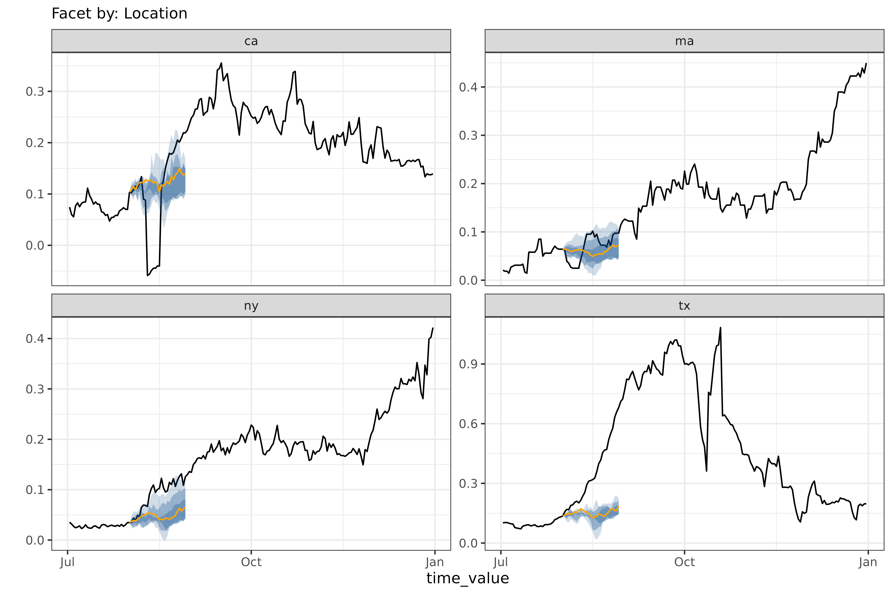
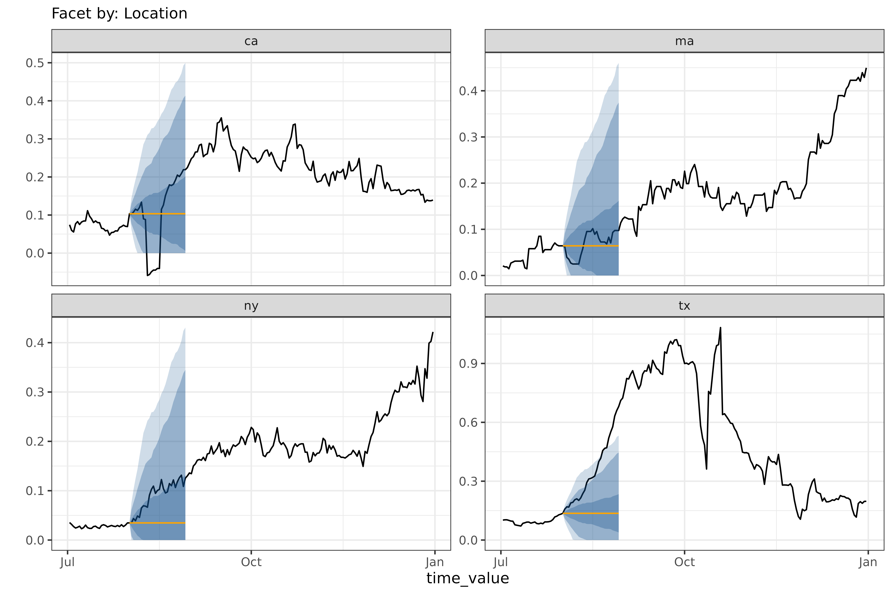
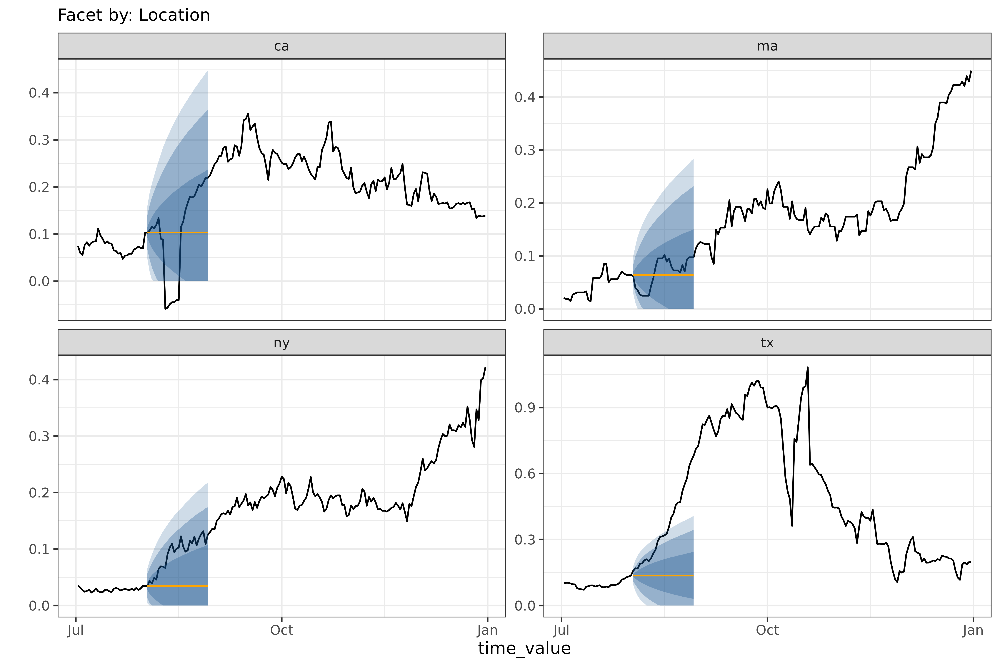
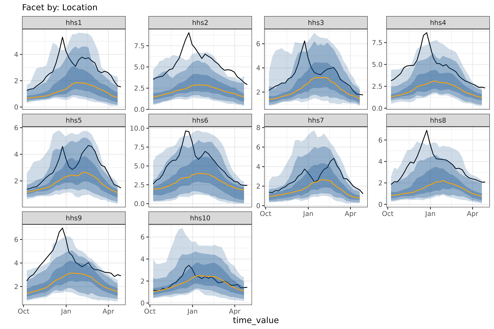
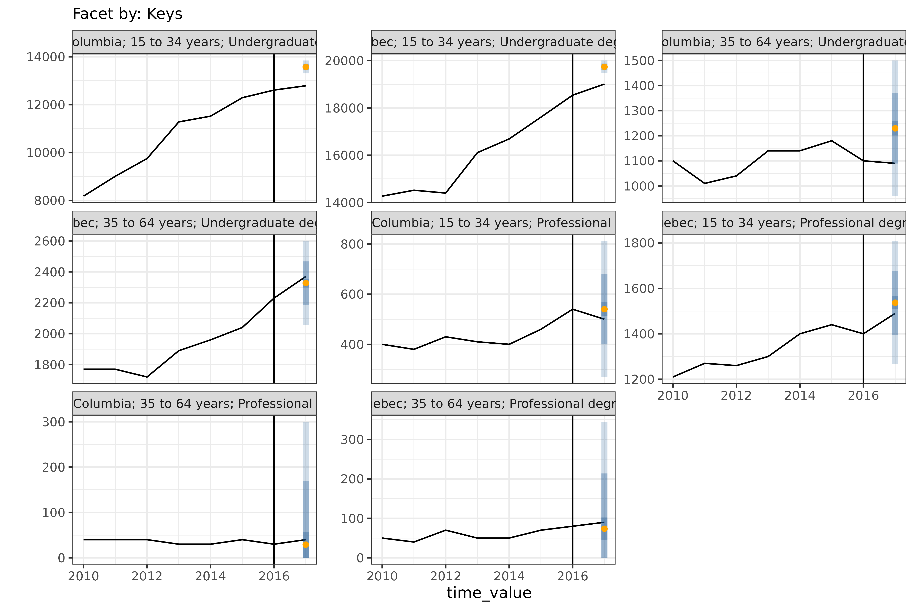

# Get started with \`epipredict\`

## Introduction

At a high level, the goal of
[epipredict](https://github.com/cmu-delphi/epipredict/) is to make it
easy to run simple machine learning and statistical forecasters for
epidemiological data. To do this, we have extended the
[tidymodels](https://www.tidymodels.org/) framework to handle the case
of panel time-series data.

Our hope is that it is easy for users with epidemiological training and
some statistical knowledge to estimate baseline models, while also
allowing those with more nuanced statistical understanding to create
complex custom models using the same framework. Towards that end,
[epipredict](https://github.com/cmu-delphi/epipredict/) provides two
main classes of tools:

### Canned forecasters

A set of basic, easy-to-use “canned” forecasters that work out of the
box. We currently provide the following basic forecasters:

- [`flatline_forecaster()`](https://cmu-delphi.github.io/epipredict/dev/reference/flatline_forecaster.md):
  predicts as the median the most recently seen value with increasingly
  wide quantiles.
- [`climatological_forecaster()`](https://cmu-delphi.github.io/epipredict/dev/reference/climatological_forecaster.md):
  predicts the median and quantiles based on the historical values
  around the same date in previous years.
- [`arx_forecaster()`](https://cmu-delphi.github.io/epipredict/dev/reference/arx_forecaster.md):
  an AutoRegressive eXogenous feature forecaster, which estimates a
  model (e.g. linear regression) on lagged data to predict quantiles for
  continuous values.
- [`arx_classifier()`](https://cmu-delphi.github.io/epipredict/dev/reference/arx_classifier.md):
  fits a model (e.g. logistic regression) on lagged data to predict a
  binned version of the growth rate.
- [`cdc_baseline_forecaster()`](https://cmu-delphi.github.io/epipredict/dev/reference/cdc_baseline_forecaster.md):
  a variant of the flatline forecaster that is used as a baseline in the
  CDC’s [FluSight forecasting
  competition](https://www.cdc.gov/flu-forecasting/about/index.html).

### Forecasting framework

A framework for creating custom forecasters out of modular components,
from which the canned forecasters were created. There are three types of
components:

- *Preprocessor*: transform the data before model training, such as
  converting counts to rates, creating smoothed columns, or [any
  `{recipes}`
  `step`](https://recipes.tidymodels.org/reference/index.html)
- *Trainer*: train a model on data, resulting in a fitted model object.
  Examples include linear regression, quantile regression, or [any
  `{parsnip}` engine](https://www.tidymodels.org/find/parsnip/).
- *Postprocessor*: unique to
  [epipredict](https://github.com/cmu-delphi/epipredict/); used to
  transform the predictions after the model has been fit, such as
  - generating quantiles from purely point-prediction models,
  - reverting operations done in the `step`s, such as converting from
    rates back to counts
  - generally adapting the format of the prediction to its eventual use.

The rest of this “Get Started” vignette will focus on using and
modifying the canned forecasters. Check out the [Custom Epiworkflows
vignette](https://cmu-delphi.github.io/epipredict/dev/articles/preprocessing-and-models)
for examples of using the forecaster framework to make more complex,
custom forecasters.

If you are interested in time series in a non-panel data context, you
may also want to look at
[timetk](https://github.com/business-science/timetk) and
[modeltime](https://github.com/business-science/modeltime) for some
related techniques.

For a more in-depth treatment with some practical applications, see also
the [Forecasting
Book](https://cmu-delphi.github.io/delphi-tooling-book/).

## Panel forecasting basics

This section gives basic usage examples for the package beyond the most
basic usage of
[`arx_forecaster()`](https://cmu-delphi.github.io/epipredict/dev/reference/arx_forecaster.md)
for forecasting a single ahead using the default engine. Before we start
actually building forecasters, lets import some relevant libraries

``` r

library(dplyr)
library(parsnip)
library(workflows)
library(recipes)
library(epidatasets)
library(epipredict)
library(epiprocess)
library(ggplot2)
library(purrr)
library(epidatr)
```

And our default forecasting date and selected states (we will use these
to limit the data to make discussion easier):

``` r

forecast_date <- as.Date("2021-08-01")
used_locations <- c("ca", "ma", "ny", "tx")
```

### Example data

The forecasting methods in this package are designed to work with panel
time series data in `epi_df` format as made available in the
[epiprocess](https://github.com/cmu-delphi/epiprocess) package. An
`epi_df` is a collection of one or more time-series indexed by one or
more categorical variables. The
[`{epidatasets}`](https://cmu-delphi.github.io/epidatasets/) package
makes several pre-compiled example datasets available. Let’s look at an
example `epi_df`:

``` r

covid_case_death_rates
#> An `epi_df` object, 20,496 x 4 with metadata:
#> * geo_type  = state
#> * time_type = day
#> * as_of     = 2023-03-10
#> Latency (time between last available observation and epi_df's as_of, by time series):
#> * latency across all time series = 434 days
#> 
#> # A tibble: 20,496 × 4
#>   geo_value time_value case_rate death_rate
#> * <chr>     <date>         <dbl>      <dbl>
#> 1 ak        2020-12-31      35.9      0.158
#> 2 al        2020-12-31      65.1      0.438
#> 3 ar        2020-12-31      66.0      1.27 
#> 4 as        2020-12-31       0        0    
#> 5 az        2020-12-31      76.8      1.10 
#> 6 ca        2020-12-31      95.9      0.755
#> # ℹ 20,490 more rows
```

An `epi_df` always has a `geo_value` and a `time_value` as keys, along
with some number of value columns, in this case `case_rate` and
`death_rate`. Each of these has an associated `geo_type` (state) and
`time_type` (day), for which there are some utilities. While this
`geo_value` and `time_value` are the minimal set of keys, the functions
of [epiprocess](https://github.com/cmu-delphi/epiprocess) and
[epipredict](https://github.com/cmu-delphi/epipredict/) are designed to
accommodate other key values, such as age, ethnicity, or other
demographic information. For example, `grad_employ_subset` from
[epidatasets](https://github.com/cmu-delphi/epidatasets) also has both
`age_group` and `edu_qual` as additional keys:

``` r

grad_employ_subset
#> An `epi_df` object, 1,445 x 7 with metadata:
#> * geo_type  = custom
#> * time_type = integer
#> * other_keys = age_group, edu_qual
#> * as_of     = 2024-09-18
#> Latency (time between last available observation and epi_df's as_of, by time series):
#> * latency across all time series = 17967–17973 (see summary() for per-signal details)
#> 
#> # A tibble: 1,445 × 7
#>   geo_value           age_group      edu_qual        time_value num_graduates
#> * <chr>               <fct>          <fct>                <int>         <dbl>
#> 1 Newfoundland and L… 15 to 34 years Career, techni…       2010           430
#> 2 Newfoundland and L… 35 to 64 years Career, techni…       2010           140
#> 3 Newfoundland and L… 15 to 34 years Career, techni…       2010           630
#> 4 Newfoundland and L… 35 to 64 years Career, techni…       2010           140
#> 5 Newfoundland and L… 15 to 34 years Other career, …       2010            60
#> 6 Newfoundland and L… 35 to 64 years Other career, …       2010            40
#> # ℹ 1,439 more rows
#> # ℹ 2 more variables: med_income_2y <dbl>, med_income_5y <dbl>
```

See [epiprocess](https://github.com/cmu-delphi/epiprocess) for [more
details on the `epi_df`
format](https://cmu-delphi.github.io/epiprocess/articles/epi_df.html).

Panel time series are ubiquitous in epidemiology, but are also common in
economics, psychology, sociology, and many other areas. While this
package was designed with epidemiology in mind, many of the techniques
are more broadly applicable.

### Customizing `arx_forecaster()`

Let’s expand on the basic example presented on the [landing
page](https://cmu-delphi.github.io/epipredict/dev/index.html#motivating-example),
starting with adjusting some parameters in
[`arx_forecaster()`](https://cmu-delphi.github.io/epipredict/dev/reference/arx_forecaster.md).

The `trainer` argument allows us to set the computational engine. We can
use either one of the relevant [parsnip
models](https://www.tidymodels.org/find/parsnip/), or one of the
included engines, such as
[`smooth_quantile_reg()`](https://cmu-delphi.github.io/epipredict/dev/reference/smooth_quantile_reg.md):

``` r

two_week_ahead <- arx_forecaster(
  covid_case_death_rates |> filter(time_value <= forecast_date),
  outcome = "death_rate",
  trainer = quantile_reg(),
  predictors = c("death_rate"),
  args_list = arx_args_list(
    lags = list(c(0, 7, 14)),
    ahead = 14
  )
)
hardhat::extract_fit_engine(two_week_ahead$epi_workflow)
#> Call:
#> quantreg::rq(formula = ..y ~ ., tau = ~c(0.05, 0.1, 0.25, 0.5, 
#> 0.75, 0.9, 0.95), data = data, na.action = stats::na.omit, method = ~"br", 
#>     model = FALSE)
#> 
#> Coefficients:
#>                      tau= 0.05  tau= 0.10 tau= 0.25  tau= 0.50  tau= 0.75
#> (Intercept)       -0.004873168 0.00000000 0.0000000 0.01867752 0.03708118
#> lag_0_death_rate   0.084091001 0.15180503 0.3076742 0.51165423 0.59058733
#> lag_7_death_rate   0.049478502 0.08493916 0.1232253 0.10018481 0.18480536
#> lag_14_death_rate  0.072304151 0.08554334 0.0712085 0.04088075 0.02609046
#>                    tau= 0.90 tau= 0.95
#> (Intercept)       0.07234641 0.1092061
#> lag_0_death_rate  0.59001978 0.5249616
#> lag_7_death_rate  0.33236190 0.4250353
#> lag_14_death_rate 0.03695928 0.1783820
#> 
#> Degrees of freedom: 10416 total; 10412 residual
```

The default trainer is
[`parsnip::linear_reg()`](https://parsnip.tidymodels.org/reference/linear_reg.html),
which generates quantiles after the fact in the post-processing layers,
rather than as part of the model. While these post-processing layers
will produce prediction intervals for an arbitrary trainer, it is
generally preferable to use
[`quantile_reg()`](https://cmu-delphi.github.io/epipredict/dev/reference/quantile_reg.md)
(or an alternative that produces statistically justifiable prediction
intervals), as the quantiles generated in post-processing can be poorly
behaved.
[`quantile_reg()`](https://cmu-delphi.github.io/epipredict/dev/reference/quantile_reg.md)
on the other hand directly estimates a different linear model for each
quantile, reflected in the several different columns for `tau` above.

Because of the flexibility of
[parsnip](https://github.com/tidymodels/parsnip), there are a whole host
of models available to us[^1]; as an example, we could have just as
easily substituted a non-linear random forest model from
[ranger](https://imbs-hl.github.io/ranger/):

``` r

two_week_ahead <- arx_forecaster(
  covid_case_death_rates |> filter(time_value <= forecast_date),
  outcome = "death_rate",
  trainer = rand_forest(mode = "regression"),
  predictors = c("death_rate"),
  args_list = arx_args_list(
    lags = list(c(0, 7, 14)),
    ahead = 14
  )
)
```

Other customization is possible via `args_list = arx_args_list()`; for
example, if we wanted to increase the number of quantiles fit:

``` r

two_week_ahead <- arx_forecaster(
  covid_case_death_rates |>
    filter(time_value <= forecast_date, geo_value %in% used_locations),
  outcome = "death_rate",
  trainer = quantile_reg(),
  predictors = c("death_rate"),
  args_list = arx_args_list(
    lags = list(c(0, 7, 14)),
    ahead = 14,
    ############ changing quantile_levels ############
    quantile_levels = c(0.05, 0.1, 0.2, 0.3, 0.5, 0.7, 0.8, 0.9, 0.95)
    ##################################################
  )
)
hardhat::extract_fit_engine(two_week_ahead$epi_workflow)
#> Call:
#> quantreg::rq(formula = ..y ~ ., tau = ~c(0.05, 0.1, 0.2, 0.3, 
#> 0.5, 0.7, 0.8, 0.9, 0.95), data = data, na.action = stats::na.omit, 
#>     method = ~"br", model = FALSE)
#> 
#> Coefficients:
#>                     tau= 0.05    tau= 0.10    tau= 0.20     tau= 0.30
#> (Intercept)       -0.01329758 -0.006999475 -0.003226356  0.0001366959
#> lag_0_death_rate   0.25217750  0.257695857  0.486159095  0.6986147165
#> lag_7_death_rate   0.17210286  0.212294203  0.114016289  0.0704290267
#> lag_14_death_rate  0.08880828  0.057022770  0.013800329 -0.0654254593
#>                      tau= 0.50    tau= 0.70    tau= 0.80   tau= 0.90
#> (Intercept)        0.004395352  0.008467922  0.005495554  0.01626215
#> lag_0_death_rate   0.751695727  0.767243828  0.743676651  0.60494554
#> lag_7_death_rate   0.208846644  0.347907095  0.460814061  0.61021640
#> lag_14_death_rate -0.164693162 -0.234886556 -0.236950849 -0.20670731
#>                     tau= 0.95
#> (Intercept)        0.03468154
#> lag_0_death_rate   0.59202848
#> lag_7_death_rate   0.64532803
#> lag_14_death_rate -0.18566431
#> 
#> Degrees of freedom: 744 total; 740 residual
```

See the function documentation for
[`arx_args_list()`](https://cmu-delphi.github.io/epipredict/dev/reference/arx_args_list.md)
for more examples of the modifications available. If you want to make
further modifications, you will need a custom workflow; see the [Custom
Epiworkflows
vignette](https://cmu-delphi.github.io/epipredict/dev/articles/custom_epiworkflows)
for details.

### Generating multiple aheads

We often want to generate a a trajectory of forecasts over a range of
dates, rather than for a single day. We can do this with
[`arx_forecaster()`](https://cmu-delphi.github.io/epipredict/dev/reference/arx_forecaster.md)
by looping over aheads. For example, to predict every day over a 4-week
time period:

``` r

all_canned_results <- lapply(
  seq(0, 28),
  \(days_ahead) {
    arx_forecaster(
      covid_case_death_rates |>
        filter(time_value <= forecast_date, geo_value %in% used_locations),
      outcome = "death_rate",
      predictors = c("case_rate", "death_rate"),
      trainer = quantile_reg(),
      args_list = arx_args_list(
        lags = list(c(0, 1, 2, 3, 7, 14), c(0, 7, 14)),
        ahead = days_ahead
      )
    )
  }
)
# pull out the workflow and the predictions to be able to
#  effectively use autoplot
workflow <- all_canned_results[[1]]$epi_workflow
results <- all_canned_results |>
  purrr::map(~ `$`(., "predictions")) |>
  list_rbind()
autoplot(
  object = workflow,
  predictions = results,
  observed_response = covid_case_death_rates |>
    filter(geo_value %in% used_locations, time_value > "2021-07-01")
)
```



### Other canned forecasters

This section gives a brief example of each of the canned forecasters.

#### `flatline_forecaster()`

The simplest model we provide is the
[`flatline_forecaster()`](https://cmu-delphi.github.io/epipredict/dev/reference/flatline_forecaster.md),
which predicts a flat line (with quantiles generated from the residuals
using
[`layer_residual_quantiles()`](https://cmu-delphi.github.io/epipredict/dev/reference/layer_residual_quantiles.md)).
For example, on the same dataset as above:

``` r

all_flatlines <- lapply(
  seq(0, 28),
  \(days_ahead) {
    flatline_forecaster(
      covid_case_death_rates |>
        filter(time_value <= forecast_date, geo_value %in% used_locations),
      outcome = "death_rate",
      args_list = flatline_args_list(
        ahead = days_ahead,
      )
    )
  }
)
# same plotting code as in the arx multi-ahead case
workflow <- all_flatlines[[1]]$epi_workflow
results <- all_flatlines |>
  purrr::map(~ `$`(., "predictions")) |>
  list_rbind()
autoplot(
  object = workflow,
  predictions = results,
  observed_response = covid_case_death_rates |> filter(geo_value %in% used_locations, time_value > "2021-07-01")
)
```



#### `cdc_baseline_forecaster()`

This is a different method of generating a flatline forecast, used as a
baseline for [the CDC COVID-19 Forecasting
Hub](https://covid19forecasthub.org).

``` r

all_cdc_flatline <-
  cdc_baseline_forecaster(
    covid_case_death_rates |>
      filter(time_value <= forecast_date, geo_value %in% used_locations),
    outcome = "death_rate",
    args_list = cdc_baseline_args_list(
      aheads = 1:28,
      data_frequency = "1 day"
    )
  )
# same plotting code as in the arx multi-ahead case
workflow <- all_cdc_flatline$epi_workflow
results <- all_cdc_flatline$predictions
autoplot(
  object = workflow,
  predictions = results,
  observed_response = covid_case_death_rates |> filter(geo_value %in% used_locations, time_value > "2021-07-01")
)
```



[`cdc_baseline_forecaster()`](https://cmu-delphi.github.io/epipredict/dev/reference/cdc_baseline_forecaster.md)
and
[`flatline_forecaster()`](https://cmu-delphi.github.io/epipredict/dev/reference/flatline_forecaster.md)
generate medians in the same way, but
[`cdc_baseline_forecaster()`](https://cmu-delphi.github.io/epipredict/dev/reference/cdc_baseline_forecaster.md)’s
quantiles are generated using
[`layer_cdc_flatline_quantiles()`](https://cmu-delphi.github.io/epipredict/dev/reference/layer_cdc_flatline_quantiles.md)
instead of
[`layer_residual_quantiles()`](https://cmu-delphi.github.io/epipredict/dev/reference/layer_residual_quantiles.md).
Both quantile-generating methods use the residuals to compute quantiles,
but
[`layer_cdc_flatline_quantiles()`](https://cmu-delphi.github.io/epipredict/dev/reference/layer_cdc_flatline_quantiles.md)
extrapolates the quantiles by repeatedly sampling the initial quantiles
to generate the next set. This results in much smoother quantiles, but
ones that only capture the one-ahead uncertainty.

#### `climatological_forecaster()`

The
[`climatological_forecaster()`](https://cmu-delphi.github.io/epipredict/dev/reference/climatological_forecaster.md)
is a different kind of baseline. It produces a point forecast and
quantiles based on the historical values for a given time of year,
rather than extrapolating from recent values. Among our forecasters, it
is the only one well suited for forecasts at long time horizons.

Since it requires multiple years of data and a roughly seasonal signal,
the dataset we’ve been using for demonstrations so far is poor example
for a climate forecast[^2]. Instead, we’ll use the fluview ILI dataset,
which is weekly influenza like illness data for hhs regions, going back
to 1997.

We’ll predict the 2023/24 season using all previous data, including
2020-2022, the two years where there was approximately no seasonal flu,
forecasting from the start of the season, `2023-10-08`:

``` r

fluview_hhs <- pub_fluview(
  regions = paste0("hhs", 1:10),
  epiweeks = epirange(100001,222201)
)
fluview <- fluview_hhs %>%
  select(
    geo_value = region,
    time_value = epiweek,
    issue,
    ili) %>%
  as_epi_archive() %>%
  epix_as_of_current()
#> inferring version column.

all_climate <- climatological_forecaster(
  fluview %>% filter(time_value < "2023-10-08"),
  outcome = "ili",
  args_list = climate_args_list(
    forecast_horizon = seq(0, 28),
    time_type = "week",
    quantile_by_key = "geo_value",
    forecast_date = as.Date("2023-10-08")
  )
)
workflow <- all_climate$epi_workflow
results <- all_climate$predictions
autoplot(
  object = workflow,
  predictions = results,
  observed_response = fluview %>%
    filter(time_value >= "2023-10-08", time_value < "2024-05-01") %>%
    mutate(geo_value = factor(geo_value, levels = paste0("hhs", 1:10)))
)
```



One feature of the climatological baseline is that it forecasts multiple
aheads simultaneously; here we do so for the entire season of 28 weeks.
This is possible for
[`arx_forecaster()`](https://cmu-delphi.github.io/epipredict/dev/reference/arx_forecaster.md),
but only using `trainer = smooth_quantile_reg()`, which is built to
handle multiple aheads simultaneously[^3].

A pure climatological forecast can be thought of as forecasting a
typical year so far. The 2023/24 had some regions, such as `hhs10` which
were quite close to the typical year, and some, such as `hhs2` that were
frequently outside even the 90% prediction band (the lightest shown
above).

#### `arx_classifier()`

Unlike the other canned forecasters, `arx_classifier` predicts binned
growth rate. The forecaster converts the raw outcome variable into a
growth rate, which it then bins and predicts, using bin thresholds
provided by the user. For example, on the same dataset and
`forecast_date` as above, this model outputs:

``` r

classifier <- arx_classifier(
  covid_case_death_rates |>
    filter(geo_value %in% used_locations, time_value < forecast_date),
  outcome = "death_rate",
  predictors = c("death_rate", "case_rate"),
  trainer = multinom_reg(),
  args_list = arx_class_args_list(
    lags = list(c(0, 1, 2, 3, 7, 14), c(0, 7, 14)),
    ahead = 2 * 7,
    breaks = 0.25 / 7
  )
)
classifier$predictions
#> # A tibble: 4 × 4
#>   geo_value .pred_class   forecast_date target_date
#>   <chr>     <fct>         <date>        <date>     
#> 1 ca        (-Inf,0.0357] 2021-07-31    2021-08-14 
#> 2 ma        (-Inf,0.0357] 2021-07-31    2021-08-14 
#> 3 ny        (-Inf,0.0357] 2021-07-31    2021-08-14 
#> 4 tx        (-Inf,0.0357] 2021-07-31    2021-08-14
```

The number and size of the growth rate categories is controlled by
`breaks`, which define the bin boundaries.

In this example, the custom `breaks` passed to
[`arx_class_args_list()`](https://cmu-delphi.github.io/epipredict/dev/reference/arx_class_args_list.md)
correspond to 2 bins: `(-∞, 0.0357]` and `(0.0357, ∞)`. The bins can be
interpreted as: `death_rate` is decreasing/growing slowly, or
`death_rate` is growing quickly.

The returned `predictions` assigns each state to one of the growth rate
bins. In this case, the classifier expects the growth rate for all 4 of
the states to fall into the same category, `(-∞, 0.0357]`.

To see how this model performed, let’s compare to the actual growth
rates for the `target_date`, as computed using
[epiprocess](https://github.com/cmu-delphi/epiprocess):

``` r

growth_rates <- covid_case_death_rates |>
  filter(geo_value %in% used_locations) |>
  group_by(geo_value) |>
  mutate(
    deaths_gr = growth_rate(x = time_value, y = death_rate)
  ) |>
  ungroup()
growth_rates |> filter(time_value == "2021-08-14")
#> An `epi_df` object, 4 x 5 with metadata:
#> * geo_type  = state
#> * time_type = day
#> * as_of     = 2023-03-10
#> Latency (time between last available observation and epi_df's as_of, by time series):
#> * latency across all time series = 573 days
#> 
#> # A tibble: 4 × 5
#>   geo_value time_value case_rate death_rate deaths_gr
#>   <chr>     <date>         <dbl>      <dbl>     <dbl>
#> 1 ca        2021-08-14      32.1    -0.0446   -1.39  
#> 2 ma        2021-08-14      16.8     0.0953    0.0633
#> 3 ny        2021-08-14      21.0     0.0946    0.0321
#> 4 tx        2021-08-14      48.4     0.311     0.0721
```

The accuracy is 50%, since all 4 states were predicted to be in the
interval `(-Inf, 0.0357]`, while two, `ca` and `ny` actually were.

### Handling multi-key panel data

If multiple keys are set in the `epi_df` as `other_keys`,
`arx_forecaster` will automatically group by those in addition to the
required geographic key. For example, predicting the number of graduates
in a subset of the categories in `grad_employ_subset` from above:

``` r

edu_quals <- c("Undergraduate degree", "Professional degree")
geo_values <- c("Quebec", "British Columbia")

grad_employ <- grad_employ_subset |>
  filter(edu_qual %in% edu_quals, geo_value %in% geo_values)

grad_employ
#> An `epi_df` object, 64 x 7 with metadata:
#> * geo_type  = custom
#> * time_type = integer
#> * other_keys = age_group, edu_qual
#> * as_of     = 2024-09-18
#> Latency (time between last available observation and epi_df's as_of, by time series):
#> * latency across all time series = 17967
#> 
#> # A tibble: 64 × 7
#>   geo_value        age_group      edu_qual           time_value num_graduates
#>   <chr>            <fct>          <fct>                   <int>         <dbl>
#> 1 Quebec           15 to 34 years Undergraduate deg…       2010         14270
#> 2 Quebec           35 to 64 years Undergraduate deg…       2010          1770
#> 3 Quebec           15 to 34 years Professional degr…       2010          1210
#> 4 Quebec           35 to 64 years Professional degr…       2010            50
#> 5 British Columbia 15 to 34 years Undergraduate deg…       2010          8180
#> 6 British Columbia 35 to 64 years Undergraduate deg…       2010          1100
#> # ℹ 58 more rows
#> # ℹ 2 more variables: med_income_2y <dbl>, med_income_5y <dbl>

grad_forecast <- arx_forecaster(
  grad_employ |>
    filter(time_value < 2017),
  outcome = "num_graduates",
  predictors = c("num_graduates"),
  args_list = arx_args_list(
    lags = list(c(0, 1, 2)),
    ahead = 1
  )
)
# and plotting
autoplot(
  grad_forecast$epi_workflow,
  grad_forecast$predictions,
  observed_response = grad_employ,
) + geom_vline(aes(xintercept = 2016))
```



The 8 graphs represent all combinations of the `geo_values` (`"Quebec"`
and `"British Columbia"`), `edu_quals` (`"Undergraduate degree"` and
`"Professional degree"`), and age brackets (`"15 to 34 years"` and
`"35 to 64 years"`).

### Estimating models without geo-pooling

The methods shown so far estimate a single model across all geographic
regions, treating them as if they are independently and identically
distributed (see [Mathematical description](#mathematical-description)
for an explicit model example). This is called “geo-pooling”. In the
context of [epipredict](https://github.com/cmu-delphi/epipredict/), the
simplest way to avoid geo-pooling and use different parameters for each
geography is to loop over the `geo_value`s:

``` r

geo_values <- covid_case_death_rates |>
  pull(geo_value) |>
  unique()

all_fits <-
  purrr::map(geo_values, \(geo) {
    covid_case_death_rates |>
      filter(
        geo_value == geo,
        time_value <= forecast_date
      ) |>
      arx_forecaster(
        outcome = "death_rate",
        trainer = linear_reg(),
        predictors = c("death_rate"),
        args_list = arx_args_list(
          lags = list(c(0, 7, 14)),
          ahead = 14
        )
      )
  })
all_fits |>
  map(~ pluck(., "predictions")) |>
  list_rbind()
#> # A tibble: 56 × 5
#>   geo_value  .pred .pred_distn forecast_date target_date
#>   <chr>      <dbl>   <qtls(7)> <date>        <date>     
#> 1 ak        0.0787    [0.0787] 2021-08-01    2021-08-15 
#> 2 al        0.206      [0.206] 2021-08-01    2021-08-15 
#> 3 ar        0.275      [0.275] 2021-08-01    2021-08-15 
#> 4 as        0              [0] 2021-08-01    2021-08-15 
#> 5 az        0.121      [0.121] 2021-08-01    2021-08-15 
#> 6 ca        0.0674    [0.0674] 2021-08-01    2021-08-15 
#> # ℹ 50 more rows
```

Estimating separate models for each geography uses far less data for
each estimate than geo-pooling and is 56 times slower[^4]. If a dataset
contains relatively few observations for each geography, fitting a
geo-pooled model is likely to produce better, more stable results.
However, geo-pooling can only be used if values are comparable in
meaning and scale across geographies or can be made comparable, for
example by normalization.

If we wanted to build a geo-aware model, such as a linear regression
with a different intercept for each geography, we would need to build a
[custom
workflow](https://cmu-delphi.github.io/epipredict/dev/articles/custom_epiworkflows)
with geography as a factor.

## Anatomy of a canned forecaster

This section describes the resulting object from
[`arx_forecaster()`](https://cmu-delphi.github.io/epipredict/dev/reference/arx_forecaster.md),
a fairly minimal description of the mathematical model used, and a
description of an `arx_fcast` object.

### Mathematical description

Let’s look at the mathematical details of the model in more detail,
using a minimal version of `four_week_ahead`:

``` r

four_week_small <- arx_forecaster(
  covid_case_death_rates |> filter(time_value <= forecast_date),
  outcome = "death_rate",
  predictors = c("case_rate", "death_rate"),
  args_list = arx_args_list(
    lags = list(c(0, 7, 14), c(0, 7, 14)),
    ahead = 4 * 7,
    quantile_levels = c(0.1, 0.25, 0.5, 0.75, 0.9)
  )
)
hardhat::extract_fit_engine(four_week_small$epi_workflow)
#> 
#> Call:
#> stats::lm(formula = ..y ~ ., data = data)
#> 
#> Coefficients:
#>       (Intercept)    lag_0_case_rate    lag_7_case_rate   lag_14_case_rate  
#>         0.0186296          0.0041617          0.0026782         -0.0003569  
#>  lag_0_death_rate   lag_7_death_rate  lag_14_death_rate  
#>         0.0929132          0.0641027          0.0348096
```

If $`d_{t,j}`$ is the death rate on day $`t`$ at location $`j`$ and
$`c_{t,j}`$ is the associated case rate, then the corresponding model
is:

``` math
\begin{aligned}
d_{t+28, j} = & a_0 + a_1 d_{t,j} + a_2 d_{t-7,j} + a_3 d_{t-14, j} +\\
     & a_4 c_{t, j} + a_5 c_{t-7, j} + a_6 c_{t-14, j} + \varepsilon_{t,j}.
\end{aligned}
```

For example, $`a_1`$ is `lag_0_death_rate` above, with a value of 0.093,
while $`a_5`$ is 0.0027. Note that unlike `d_{t,j}` or `c_{t,j}`, these
*don’t* depend on either the time $`t`$ or the location $`j`$. This is
what make it a geo-pooled model.

The training data for estimating the parameters of this linear model is
constructed within the
[`arx_forecaster()`](https://cmu-delphi.github.io/epipredict/dev/reference/arx_forecaster.md)
function by shifting a series of columns the appropriate amount – based
on the requested `lags`. Each row containing no `NA` values in the
predictors is used as a training observation to fit the coefficients
$`a_0,\ldots, a_6`$.

The equation above is only an accurate description of the model for a
linear engine like
[`quantile_reg()`](https://cmu-delphi.github.io/epipredict/dev/reference/quantile_reg.md)
or
[`linear_reg()`](https://parsnip.tidymodels.org/reference/linear_reg.html);
a nonlinear model like `rand_forest(mode = "regression")` will use the
same input variables and training data, but fit the appropriate model
for them.

### Code object

Let’s dissect the forecaster we trained back on the [landing
page](https://cmu-delphi.github.io/epipredict/dev/index.html#motivating-example):

``` r

four_week_ahead <- arx_forecaster(
  covid_case_death_rates |> filter(time_value <= forecast_date),
  outcome = "death_rate",
  predictors = c("case_rate", "death_rate"),
  args_list = arx_args_list(
    lags = list(c(0, 1, 2, 3, 7, 14), c(0, 7, 14)),
    ahead = 4 * 7,
    quantile_levels = c(0.1, 0.25, 0.5, 0.75, 0.9)
  )
)
```

`four_week_ahead` has three components: an `epi_workflow`, a table of
`predictions`, and a list of `metadata`. The table of predictions is a
simple tibble,

``` r

four_week_ahead$predictions
#> # A tibble: 56 × 5
#>   geo_value  .pred .pred_distn forecast_date target_date
#>   <chr>      <dbl>   <qtls(5)> <date>        <date>     
#> 1 ak        0.234      [0.234] 2021-08-01    2021-08-29 
#> 2 al        0.290       [0.29] 2021-08-01    2021-08-29 
#> 3 ar        0.482      [0.482] 2021-08-01    2021-08-29 
#> 4 as        0.0190     [0.019] 2021-08-01    2021-08-29 
#> 5 az        0.182      [0.182] 2021-08-01    2021-08-29 
#> 6 ca        0.178      [0.178] 2021-08-01    2021-08-29 
#> # ℹ 50 more rows
```

where `.pred` gives the point/median prediction, and `.pred_distn` is a
[`hardhat::quantile_pred()`](https://hardhat.tidymodels.org/reference/quantile_pred.html)
object representing a distribution through various quantile levels. The
`5` in `<qtls(5)>` refers to the number of quantiles that have been
explicitly created, while the \[0.234\] is the median value[^5]. By
default, `.pred_distn` covers the quantiles
`c(0.05, 0.1, 0.25, 0.5, 0.75, 0.9, 0.95)`.

The `epi_workflow` is a significantly more complicated object, extending
a
[`workflows::workflow()`](https://workflows.tidymodels.org/reference/workflow.html)
to include post-processing steps:

``` r

four_week_ahead$epi_workflow
#> 
#> ══ Epi Workflow [trained] ═══════════════════════════════════════════════════
#> Preprocessor: Recipe
#> Model: linear_reg()
#> Postprocessor: Frosting
#> 
#> ── Preprocessor ─────────────────────────────────────────────────────────────
#> 
#> 7 Recipe steps.
#> 1. step_epi_lag()
#> 2. step_epi_lag()
#> 3. step_epi_ahead()
#> 4. step_naomit()
#> 5. step_naomit()
#> 6. step_training_window()
#> 7. check_enough_data()
#> 
#> ── Model ────────────────────────────────────────────────────────────────────
#> 
#> Call:
#> stats::lm(formula = ..y ~ ., data = data)
#> 
#> Coefficients:
#>       (Intercept)    lag_0_case_rate    lag_1_case_rate    lag_2_case_rate  
#>         0.0190429          0.0022671         -0.0003564          0.0007037  
#>   lag_3_case_rate    lag_7_case_rate   lag_14_case_rate   lag_0_death_rate  
#>         0.0027288          0.0013392         -0.0002427          0.0926092  
#>  lag_7_death_rate  lag_14_death_rate  
#>         0.0640675          0.0347603
#> 
#> ── Postprocessor ────────────────────────────────────────────────────────────
#> 
#> 5 Frosting layers.
#> 1. layer_predict()
#> 2. layer_residual_quantiles()
#> 3. layer_add_forecast_date()
#> 4. layer_add_target_date()
#> 5. layer_threshold()
#> 
```

An
[`epi_workflow()`](https://cmu-delphi.github.io/epipredict/dev/reference/epi_workflow.md)
consists of 3 parts:

- `preprocessor`: a collection of steps that transform the data to be
  ready for modelling. Steps can be custom, as are those included in
  this package, or [be defined in
  `{recipes}`](https://recipes.tidymodels.org/reference/index.html).
  `four_week_ahead` has 5 steps; you can inspect them more closely by
  running `hardhat::extract_recipe(four_week_ahead$epi_workflow)`.[^6]
- `spec`: a
  [`parsnip::model_spec`](https://parsnip.tidymodels.org/reference/model_spec.html)
  which includes both the model parameters and an engine to fit those
  parameters to the training data as prepared by `preprocessor`.
  `four_week_ahead` uses the default of
  [`parsnip::linear_reg()`](https://parsnip.tidymodels.org/reference/linear_reg.html),
  which is a [parsnip](https://github.com/tidymodels/parsnip) wrapper
  for several linear regression engines, by default
  [`stats::lm()`](https://rdrr.io/r/stats/lm.html). You can inspect the
  model more closely by running
  `hardhat::extract_fit_recipe(four_week_ahead$epi_workflow)`.
- `postprocessor`: a collection of layers to be applied to the resulting
  forecast. Layers are internal to this package. `four_week_ahead` just
  so happens to have 5 of as these well. You can inspect the layers more
  closely by running
  `epipredict::extract_layers(four_week_ahead$epi_workflow)`.

See the [Custom Epiworkflows
vignette](https://cmu-delphi.github.io/epipredict/dev/articles/custom_epiworkflows)
for recreating and then extending `four_week_ahead` using the custom
forecaster framework.

[^1]: in the case of `arx_forecaster`, this is any model with
    `mode="regression"` from [this
    list](https://www.tidymodels.org/find/parsnip/).

[^2]: It has only a year of data, which is barely enough to run the
    method without errors, let alone get a meaningful prediction.

[^3]: Though not 28 weeks into the future! Such a forecast will likely
    be absurdly low or high.

[^4]: the number of geographies

[^5]: in the case of a [parsnip](https://github.com/tidymodels/parsnip)
    engine which doesn’t explicitly predict quantiles, these quantiles
    are created using
    [`layer_residual_quantiles()`](https://cmu-delphi.github.io/epipredict/dev/reference/layer_residual_quantiles.md),
    which infers the quantiles from the residuals of the fit.

[^6]: alternatively, for an unfit version of the preprocessor, you can
    call `hardhat::extract_preprocessor(four_week_ahead$epi_workflow)`
