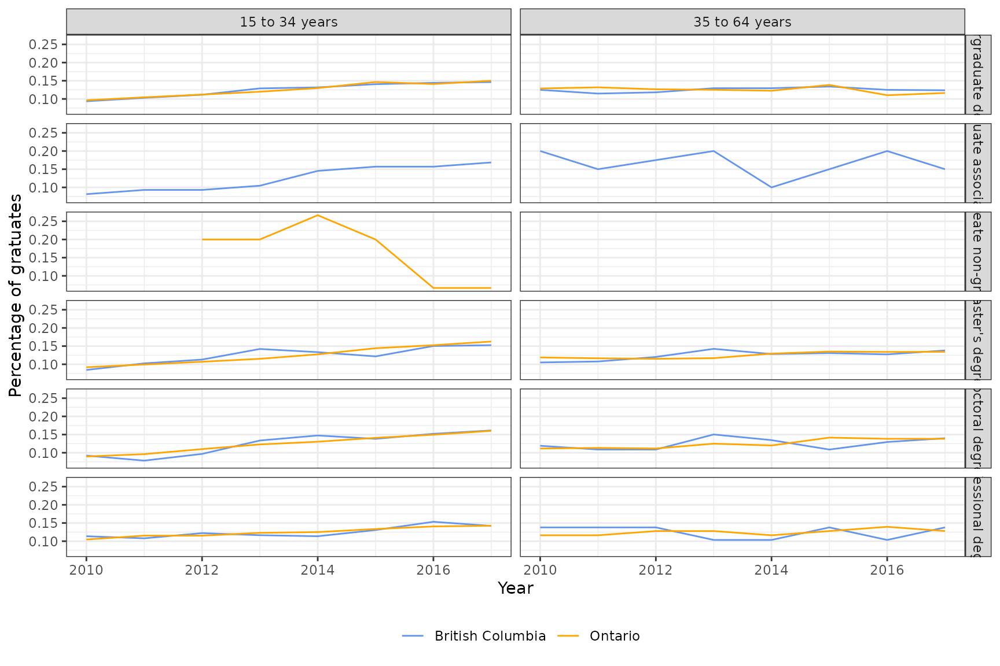
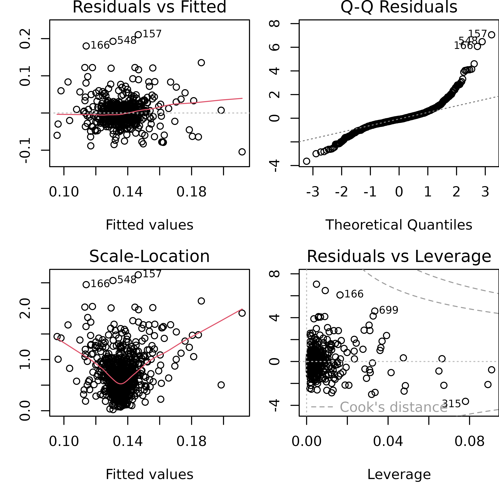

# Using epipredict on non-epidemic panel data

``` r

library(dplyr)
library(tidyr)
library(parsnip)
library(recipes)
library(epiprocess)
library(epipredict)
library(epidatasets)
library(ggplot2)
theme_set(theme_bw())
```

[Panel data](https://en.wikipedia.org/wiki/Panel_data), or longitudinal
data, contain cross-sectional measurements of subjects over time. The
`epipredict` package is most suitable for running forecasters on
epidemiological panel data. An example of this is the
[`covid_case_death_rates`](https://cmu-delphi.github.io/epidatasets/reference/covid_case_death_rates.html)
dataset, which contains daily state-wise measures of `case_rate` and
`death_rate` for COVID-19 in 2021:

``` r

head(covid_case_death_rates, 3)
#> An `epi_df` object, 3 x 4 with metadata:
#> * geo_type  = state
#> * time_type = day
#> * as_of     = 2023-03-10
#> Latency (time between last available observation and epi_df's as_of, by time series):
#> * latency across all time series = 799 days
#> 
#> # A tibble: 3 × 4
#>   geo_value time_value case_rate death_rate
#>   <chr>     <date>         <dbl>      <dbl>
#> 1 ak        2020-12-31      35.9      0.158
#> 2 al        2020-12-31      65.1      0.438
#> 3 ar        2020-12-31      66.0      1.27
```

`epipredict` functions work with data in
[`epi_df`](https://cmu-delphi.github.io/epiprocess/reference/epi_df.html)
format. Despite the stated goal and name of the package, other panel
datasets are also valid candidates for `epipredict` functionality, as
long as they are in `epi_df` format.

## Example panel data overview

In this vignette, we will demonstrate using `epipredict` with employment
panel data from Statistics Canada. We will be using [Table
37-10-0115-01: Characteristics and median employment income of
longitudinal cohorts of postsecondary graduates two and five years after
graduation, by educational qualification and field of study (primary
groupings)](https://www150.statcan.gc.ca/t1/tbl1/en/tv.action?pid=3710011501).

The full dataset contains yearly median employment income two and five
years after graduation, and number of graduates. The data is stratified
by variables such as geographic region (Canadian province), education,
and age group. The year range of the dataset is 2010 to 2017, inclusive.
The full dataset also contains metadata that describes the quality of
data collected. For demonstration purposes, we make the following
modifications to get a subset of the full dataset:

- Only keep provincial-level geographic region (the full data also has
  “Canada” as a region)
- Only keep “good” or better quality data rows, as indicated by the
  [`STATUS`](https://www.statcan.gc.ca/en/concepts/definitions/guide-symbol)
  column
- Choose a subset of covariates and aggregate across the remaining ones.
  The chosen covariates are age group, and educational qualification.

To use this data with `epipredict`, we need to convert it into `epi_df`
format using
[`epiprocess::as_epi_df()`](https://cmu-delphi.github.io/epiprocess/reference/epi_df.html)
with additional keys. In our case, the additional keys are `age_group`,
and `edu_qual`. Note that in the above modifications, we encoded
`time_value` as type `integer`. This lets us set `time_type = "year"`,
and ensures that lag and ahead modifications later on are using the
correct time units. See the
[`epiprocess::epi_df`](https://cmu-delphi.github.io/epiprocess/reference/epi_df.html)
for a list of all the `time_type`s available.

Now, we are ready to use `grad_employ_subset` with `epipredict`. Our
`epi_df` contains 1,445 rows and 7 columns. Here is a quick summary of
the columns in our `epi_df`:

- `time_value` (time value): year in `date` format
- `geo_value` (geo value): province in Canada
- `num_graduates` (raw, time series value): number of graduates
- `med_income_2y` (raw, time series value): median employment income 2
  years after graduation
- `med_income_5y` (raw, time series value): median employment income 5
  years after graduation
- `age_group` (key): one of two age groups, either 15 to 34 years, or 35
  to 64 years
- `edu_qual` (key): one of 32 unique educational qualifications, e.g.,
  “Master’s diploma”

``` r

# Rename for simplicity
employ <- grad_employ_subset
sample_n(employ, 6)
#> An `epi_df` object, 6 x 7 with metadata:
#> * geo_type  = custom
#> * time_type = integer
#> * other_keys = age_group, edu_qual
#> * as_of     = 2024-09-18
#> Latency (time between last available observation and epi_df's as_of, by time series):
#> * latency across all time series = 17967–17974 (see summary() for per-signal details)
#> 
#> # A tibble: 6 × 7
#>   geo_value        age_group      edu_qual           time_value num_graduates
#>   <chr>            <fct>          <fct>                   <int>         <dbl>
#> 1 Saskatchewan     35 to 64 years Undergraduate cer…       2016           120
#> 2 British Columbia 35 to 64 years Post-baccalaureat…       2017           240
#> 3 Saskatchewan     35 to 64 years Post-baccalaureat…       2012            10
#> 4 Quebec           15 to 34 years Master's certific…       2010            80
#> 5 British Columbia 35 to 64 years Career, technical…       2012          3060
#> 6 New Brunswick    35 to 64 years Career, technical…       2013           230
#> # ℹ 2 more variables: med_income_2y <dbl>, med_income_5y <dbl>
```

In the following sections, we will go over pre-processing the data in
the `epi_recipe` framework, and estimating a model and making
predictions within the `epipredict` framework and using the package’s
canned forecasters.

## Autoregressive (AR) model to predict number of graduates in a year

### Pre-processing

As a simple example, let’s work with the `num_graduates` column for now.
We will first pre-process by standardizing each numeric column by the
total within each group of keys. We do this since those raw numeric
values will vary greatly from province to province since there are large
differences in population.

``` r

employ_small <- employ %>%
  group_by(geo_value, age_group, edu_qual) %>%
  # Select groups where there are complete time series values
  filter(n() >= 6) %>%
  mutate(
    num_graduates_prop = num_graduates / sum(num_graduates),
    med_income_2y_prop = med_income_2y / sum(med_income_2y),
    med_income_5y_prop = med_income_5y / sum(med_income_5y)
  ) %>%
  ungroup()
head(employ_small)
#> An `epi_df` object, 6 x 10 with metadata:
#> * geo_type  = custom
#> * time_type = integer
#> * other_keys = age_group, edu_qual
#> * as_of     = 2024-09-18
#> Latency (time between last available observation and epi_df's as_of, by time series):
#> * latency across all time series = 17974
#> 
#> # A tibble: 6 × 10
#>   geo_value           age_group      edu_qual        time_value num_graduates
#>   <chr>               <fct>          <fct>                <int>         <dbl>
#> 1 Newfoundland and L… 15 to 34 years Career, techni…       2010           430
#> 2 Newfoundland and L… 35 to 64 years Career, techni…       2010           140
#> 3 Newfoundland and L… 15 to 34 years Career, techni…       2010           630
#> 4 Newfoundland and L… 35 to 64 years Career, techni…       2010           140
#> 5 Newfoundland and L… 15 to 34 years Undergraduate …       2010          1050
#> 6 Newfoundland and L… 35 to 64 years Undergraduate …       2010           130
#> # ℹ 5 more variables: med_income_2y <dbl>, med_income_5y <dbl>,
#> #   num_graduates_prop <dbl>, med_income_2y_prop <dbl>, …
```

Below is a visualization for a sample of the small data for British
Columbia and Ontario. Note that some groups do not have any time series
information since we filtered out all time series with incomplete dates.

``` r

employ_small %>%
  filter(geo_value %in% c("British Columbia", "Ontario")) %>%
  filter(grepl("degree", edu_qual, fixed = T)) %>%
  group_by(geo_value, time_value, edu_qual, age_group) %>%
  summarise(num_graduates_prop = sum(num_graduates_prop), .groups = "drop") %>%
  ggplot(aes(x = time_value, y = num_graduates_prop, color = geo_value)) +
  geom_line() +
  scale_colour_manual(values = c("Cornflowerblue", "Orange"), name = "") +
  facet_grid(rows = vars(edu_qual), cols = vars(age_group)) +
  xlab("Year") +
  ylab("Percentage of gratuates") +
  theme(legend.position = "bottom")
```



We will predict the standardized number of graduates (a proportion) in
the next year (time $`t+1`$) using an autoregressive model with three
lags (i.e., an AR(3) model). Such a model is represented algebraically
like this:

``` math
  y_{t+1,ijk} =
  \alpha_0 + \alpha_1 y_{tijk} + \alpha_2 y_{t-1,ijk} + \alpha_3 y_{t-2,ijk} + \epsilon_{tijk}
```

where $`y_{tij}`$ is the proportion of graduates at time $`t`$ in
location $`i`$ and age group $`j`$ with education quality $`k`$.

In the pre-processing step, we need to create additional columns in
`employ` for each of $`y_{t+1,ijk}`$, $`y_{tijk}`$, $`y_{t-1,ijk}`$, and
$`y_{t-2,ijk}`$. We do this via an `epi_recipe`. Note that creating an
`epi_recipe` alone doesn’t add these outcome and predictor columns; the
recipe just stores the instructions for adding them.

Our `epi_recipe` should add one `ahead` column representing
$`y_{t+1,ijk}`$ and 3 `lag` columns representing $`y_{tijk}`$,
$`y_{t-1,ijk}`$, and $`y_{t-2,ijk}`$ (it’s more accurate to think of the
0th “lag” as the “current” value with 2 lags, but that’s not quite how
the processing works). Also note that since we specified our `time_type`
to be `year`, our `lag` and `lead` values are both in years.

``` r

r <- epi_recipe(employ_small) %>%
  step_epi_ahead(num_graduates_prop, ahead = 1) %>%
  step_epi_lag(num_graduates_prop, lag = 0:2) %>%
  step_epi_naomit()
r
#> 
#> ── Epi Recipe ───────────────────────────────────────────────────────────────
#> 
#> ── Inputs
#> Number of variables by role
#> raw:        6
#> key:        2
#> geo_value:  1
#> time_value: 1
#> 
#> ── Operations
#> 1. Leading: num_graduates_prop by 1
#> 2. Lagging: num_graduates_prop by 0, 1, 2
#> 3. • Removing rows with NA values in: all_predictors()
#> 4. • Removing rows with NA values in: all_outcomes()
```

Let’s apply this recipe using `prep` and `bake` to generate and view the
`lag` and `ahead` columns.

``` r

# Display a sample of the pre-processed data
bake_and_show_sample <- function(recipe, data, n = 5) {
  recipe %>%
    prep(data) %>%
    bake(new_data = data) %>%
    sample_n(n)
}

r %>% bake_and_show_sample(employ_small)
#> An `epi_df` object, 5 x 14 with metadata:
#> * geo_type  = custom
#> * time_type = integer
#> * other_keys = age_group, edu_qual
#> * as_of     = 2024-09-18
#> Latency (time between last available observation and epi_df's as_of, by time series):
#> * latency across all time series = 17968–17972 (see summary() for per-signal details)
#> 
#> # A tibble: 5 × 14
#>   geo_value        age_group      edu_qual           time_value num_graduates
#>   <chr>            <fct>          <fct>                   <dbl>         <dbl>
#> 1 Ontario          35 to 64 years Master's diploma         2012            40
#> 2 British Columbia 15 to 34 years Undergraduate deg…       2014         11520
#> 3 Alberta          35 to 64 years Career, technical…       2013          1270
#> 4 Alberta          35 to 64 years Undergraduate deg…       2016          1050
#> 5 Quebec           15 to 34 years Career, technical…       2016          3920
#> # ℹ 9 more variables: med_income_2y <dbl>, med_income_5y <dbl>,
#> #   num_graduates_prop <dbl>, med_income_2y_prop <dbl>, …
```

We can see that the `prep` and `bake` steps created new columns
according to our `epi_recipe`:

- `ahead_1_num_graduates_prop` corresponds to $`y_{t+1,ijk}`$
- `lag_0_num_graduates_prop`, `lag_1_num_graduates_prop`, and
  `lag_2_num_graduates_prop` correspond to $`y_{tijk}`$,
  $`y_{t-1,ijk}`$, and $`y_{t-2,ijk}`$ respectively.

### Model estimation and prediction

Since our goal for now is to estimate a simple autoregressive model, we
can use
[`parsnip::linear_reg()`](https://parsnip.tidymodels.org/reference/linear_reg.html)
with the default engine `lm`, which fits a linear regression using
ordinary least squares.

We will use `epi_workflow` with the `epi_recipe` we defined in the
pre-processing section along with the
[`parsnip::linear_reg()`](https://parsnip.tidymodels.org/reference/linear_reg.html)
model. Note that `epi_workflow` is a container and doesn’t actually do
the fitting. We have to pass the workflow into
[`fit()`](https://generics.r-lib.org/reference/fit.html) to get our
estimated model coefficients $`\widehat{\alpha}_i,\ i=0,...,3`$.

``` r

wf_linreg <- epi_workflow(r, linear_reg()) %>%
  fit(employ_small)
summary(extract_fit_engine(wf_linreg))
#> 
#> Call:
#> stats::lm(formula = ..y ~ ., data = data)
#> 
#> Residuals:
#>       Min        1Q    Median        3Q       Max 
#> -0.104501 -0.013043 -0.002708  0.009289  0.210582 
#> 
#> Coefficients:
#>                           Estimate Std. Error t value Pr(>|t|)    
#> (Intercept)               0.108532   0.006695  16.211  < 2e-16 ***
#> lag_0_num_graduates_prop  0.324251   0.037163   8.725  < 2e-16 ***
#> lag_1_num_graduates_prop  0.014190   0.038543   0.368 0.712848    
#> lag_2_num_graduates_prop -0.137378   0.036337  -3.781 0.000168 ***
#> ---
#> Signif. codes:  0 '***' 0.001 '**' 0.01 '*' 0.05 '.' 0.1 ' ' 1
#> 
#> Residual standard error: 0.02993 on 777 degrees of freedom
#> Multiple R-squared:  0.1084, Adjusted R-squared:  0.1049 
#> F-statistic: 31.47 on 3 and 777 DF,  p-value: < 2.2e-16
```

This output tells us the coefficients of the fitted model; for instance,
the estimated intercept is $`\widehat{\alpha}_0 =`$ 0.109 and the
coefficient for $`y_{tijk}`$ is $`\widehat\alpha_1 =`$ 0.324. The
summary also tells us that all estimated coefficients are significantly
different from zero. Extracting the 95% confidence intervals for the
coefficients also leads us to the same conclusion: all the coefficient
estimates are significantly different from 0.

``` r

confint(extract_fit_engine(wf_linreg))
#>                                2.5 %      97.5 %
#> (Intercept)               0.09538942  0.12167466
#> lag_0_num_graduates_prop  0.25130008  0.39720211
#> lag_1_num_graduates_prop -0.06147071  0.08985152
#> lag_2_num_graduates_prop -0.20870743 -0.06604791
```

Now that we have our workflow, we can generate predictions from a subset
of our data. For this demo, we will predict the number of graduates
using the last 2 years of our dataset.

``` r

latest <- get_test_data(recipe = r, x = employ_small)
preds <- stats::predict(wf_linreg, latest) %>% filter(!is.na(.pred))
# Display a sample of the prediction values, excluding NAs
preds %>% sample_n(5)
#> An `epi_df` object, 5 x 5 with metadata:
#> * geo_type  = custom
#> * time_type = integer
#> * other_keys = age_group, edu_qual
#> * as_of     = 2024-09-18
#> Latency (time between last available observation and epi_df's as_of, by time series):
#> * latency  = 17967
#> 
#> # A tibble: 5 × 5
#>   geo_value                 age_group      edu_qual          time_value .pred
#>   <chr>                     <fct>          <fct>                  <dbl> <dbl>
#> 1 New Brunswick             15 to 34 years Professional deg…       2017 0.141
#> 2 British Columbia          15 to 34 years Career, technica…       2017 0.134
#> 3 Nova Scotia               15 to 34 years Master's degree         2017 0.133
#> 4 Ontario                   15 to 34 years Undergraduate ce…       2017 0.161
#> 5 Newfoundland and Labrador 15 to 34 years Master's degree         2017 0.139
```

We can do this using the `augment` function too. Note that `predict` and
`augment` both still return an
[`epiprocess::epi_df`](https://cmu-delphi.github.io/epiprocess/reference/epi_df.html)
with all of the keys that were present in the original dataset.

``` r

augment(wf_linreg, latest) %>% sample_n(5)
#> An `epi_df` object, 5 x 11 with metadata:
#> * geo_type  = custom
#> * time_type = integer
#> * other_keys = age_group, edu_qual
#> * as_of     = 2024-09-18
#> Latency (time between last available observation and epi_df's as_of, by time series):
#> * latency across all time series = 17967–17969 (see summary() for per-signal details)
#> * Empty time series detected
#> # A tibble: 5 × 11
#>   geo_value        age_group      edu_qual                  time_value  .pred
#>   <chr>            <fct>          <fct>                          <dbl>  <dbl>
#> 1 British Columbia 35 to 64 years Post-baccalaureate non-g…       2017  0.143
#> 2 Saskatchewan     15 to 34 years Career, technical or pro…       2015 NA    
#> 3 Manitoba         15 to 34 years Career, technical or pro…       2016 NA    
#> 4 Saskatchewan     35 to 64 years Doctoral degree                 2017  0.135
#> 5 Manitoba         35 to 64 years Other career, technical …       2016 NA    
#> # ℹ 6 more variables: num_graduates <dbl>, med_income_2y <dbl>,
#> #   med_income_5y <dbl>, num_graduates_prop <dbl>, …
```

### Model diagnostics

First, we’ll plot the residuals (that is,
$`y_{tijk} - \widehat{y}_{tijk}`$) against the fitted values
($`\widehat{y}_{tijk}`$).

``` r

par(mfrow = c(2, 2), mar = c(5, 3, 1.2, 0))
plot(extract_fit_engine(wf_linreg))
```



The fitted values vs. residuals plot shows us that the residuals are
mostly clustered around zero, but do not form an even band around the
zero line, indicating that the variance of the residuals is not
constant. Additionally, the fitted values vs. square root of
standardized residuals makes this more obvious - the spread of the
square root of standardized residuals varies with the fitted values.

The Q-Q plot shows us that the residuals have heavier tails than a
Normal distribution. So the normality of residuals assumption doesn’t
hold either.

Finally, the residuals vs. leverage plot shows us that we have a few
influential points based on the Cook’s distance (those outside the red
dotted line).

Since we appear to be violating the linear model assumptions, we might
consider transforming our data differently, or considering a non-linear
model, or something else.

## AR model with exogenous inputs

Now suppose we want to model the 1-step-ahead 5-year employment income
using current and two previous values, while also incorporating
information from the other two time-series in our dataset: the 2-year
employment income and the number of graduates in the previous 2 years.
We would do this using an autoregressive model with exogenous inputs,
defined as follows:

``` math
\begin{aligned}
  y_{t+1,ijk} &=
  \alpha_0 + \alpha_1 y_{tijk} + \alpha_2 y_{t-1,ijk} + \alpha_3 y_{t-2,ijk}\\
  &\quad + \beta_1 x_{tijk} + \beta_2 x_{t-1,ijk}\\
  &\quad + \gamma_2 z_{tijk} + \gamma_2 z_{t-1,ijk} + \epsilon_{tijk}
\end{aligned}
```

where $`y_{tijk}`$ is the 5-year median income (proportion) at time
$`t`$ (in location $`i`$, age group $`j`$ with education quality $`k`$),
$`x_{tijk}`$ is the 2-year median income (proportion) at time $`t`$, and
$`z_{tijk}`$ is the number of graduates (proportion) at time $`t`$.

### Pre-processing

Again, we construct an `epi_recipe` detailing the pre-processing steps.

``` r

rx <- epi_recipe(employ_small) %>%
  step_epi_ahead(med_income_5y_prop, ahead = 1) %>%
  # 5-year median income has current, and two lags c(0, 1, 2)
  step_epi_lag(med_income_5y_prop, lag = 0:2) %>%
  # But the two exogenous variables have current values, and 1 lag c(0, 1)
  step_epi_lag(med_income_2y_prop, lag = c(0, 1)) %>%
  step_epi_lag(num_graduates_prop, lag = c(0, 1)) %>%
  step_epi_naomit()

bake_and_show_sample(rx, employ_small)
#> An `epi_df` object, 5 x 18 with metadata:
#> * geo_type  = custom
#> * time_type = integer
#> * other_keys = age_group, edu_qual
#> * as_of     = 2024-09-18
#> Latency (time between last available observation and epi_df's as_of, by time series):
#> * latency across all time series = 17967–17970 (see summary() for per-signal details)
#> * Empty time series detected
#> # A tibble: 5 × 18
#>   geo_value           age_group      edu_qual        time_value num_graduates
#>   <chr>               <fct>          <fct>                <dbl>         <dbl>
#> 1 Prince Edward Isla… 35 to 64 years Undergraduate …       2017            10
#> 2 British Columbia    35 to 64 years Post-baccalaur…       2014           180
#> 3 Alberta             35 to 64 years Career, techni…       2016          1250
#> 4 Saskatchewan        15 to 34 years Undergraduate …       2015          2600
#> 5 Saskatchewan        15 to 34 years Doctoral degree       2016            70
#> # ℹ 13 more variables: med_income_2y <dbl>, med_income_5y <dbl>,
#> #   num_graduates_prop <dbl>, med_income_2y_prop <dbl>, …
```

### Model estimation & post-processing

Before estimating our model and making predictions, let’s add some
post-processing steps using a few
[`frosting`](https://cmu-delphi.github.io/epipredict/reference/frosting.html)
layers to do a few things:

1.  Threshold our predictions to 0. We are predicting proportions, which
    can’t be negative. And the transformed values back to dollars and
    people can’t be negative either.
2.  Generate prediction intervals based on residual quantiles, allowing
    us to quantify the uncertainty associated with future predicted
    values.
3.  Convert our predictions back to income values and number of
    graduates, rather than standardized proportions. We do this via the
    frosting layer
    [`layer_population_scaling()`](https://cmu-delphi.github.io/epipredict/dev/reference/layer_population_scaling.md).

``` r

# Create dataframe of the sums we used for standardizing
# Only have to include med_income_5y since that is our outcome
totals <- employ_small %>%
  group_by(geo_value, age_group, edu_qual) %>%
  summarise(med_income_5y_tot = sum(med_income_5y), .groups = "drop")

# Define post-processing steps
f <- frosting() %>%
  layer_predict() %>%
  layer_naomit(.pred) %>%
  layer_threshold(.pred, lower = 0) %>%
  # 90% prediction interval
  layer_residual_quantiles(
    symmetrize = FALSE
  ) %>%
  layer_population_scaling(
    .pred, .pred_distn,
    df = totals, df_pop_col = "med_income_5y_tot"
  )

wfx_linreg <- epi_workflow(rx, parsnip::linear_reg()) %>%
  fit(employ_small) %>%
  add_frosting(f)

summary(extract_fit_engine(wfx_linreg))
#> 
#> Call:
#> stats::lm(formula = ..y ~ ., data = data)
#> 
#> Residuals:
#>       Min        1Q    Median        3Q       Max 
#> -0.049668 -0.004509 -0.000516  0.004707  0.049882 
#> 
#> Coefficients:
#>                           Estimate Std. Error t value Pr(>|t|)    
#> (Intercept)               0.041278   0.004975   8.298 4.72e-16 ***
#> lag_0_med_income_5y_prop  0.320780   0.049348   6.500 1.44e-10 ***
#> lag_1_med_income_5y_prop  0.079610   0.049116   1.621  0.10546    
#> lag_2_med_income_5y_prop  0.073048   0.033686   2.168  0.03043 *  
#> lag_0_med_income_2y_prop  0.118122   0.045579   2.592  0.00973 ** 
#> lag_1_med_income_2y_prop  0.034455   0.042749   0.806  0.42050    
#> lag_0_num_graduates_prop -0.025129   0.013603  -1.847  0.06509 .  
#> lag_1_num_graduates_prop  0.078268   0.013396   5.842 7.58e-09 ***
#> ---
#> Signif. codes:  0 '***' 0.001 '**' 0.01 '*' 0.05 '.' 0.1 ' ' 1
#> 
#> Residual standard error: 0.01056 on 773 degrees of freedom
#> Multiple R-squared:  0.3224, Adjusted R-squared:  0.3163 
#> F-statistic: 52.54 on 7 and 773 DF,  p-value: < 2.2e-16
```

Based on the summary output for this model, we can examine confidence
intervals and perform hypothesis tests as usual.

Let’s take a look at the predictions along with their 90% prediction
intervals.

``` r

latest <- get_test_data(recipe = rx, x = employ_small)
predsx <- predict(wfx_linreg, latest)

# Display predictions along with prediction intervals
predsx %>%
  select(
    geo_value, time_value, edu_qual, age_group,
    .pred_scaled, .pred_distn_scaled
  ) %>%
  head() %>%
  pivot_quantiles_wider(.pred_distn_scaled)
#> An `epi_df` object, 6 x 12 with metadata:
#> * geo_type  = custom
#> * time_type = integer
#> * other_keys = age_group, edu_qual
#> * as_of     = 2024-09-18
#> Latency (time between last available observation and epi_df's as_of, by time series):
#> * latency across all time series = 17967
#> 
#> # A tibble: 6 × 12
#>   geo_value            time_value edu_qual        age_group      .pred_scaled
#>   <chr>                     <dbl> <fct>           <fct>                 <dbl>
#> 1 Newfoundland and La…       2017 Career, techni… 15 to 34 years       45724.
#> 2 Newfoundland and La…       2017 Career, techni… 35 to 64 years       37614.
#> 3 Newfoundland and La…       2017 Career, techni… 15 to 34 years       56992.
#> 4 Newfoundland and La…       2017 Career, techni… 35 to 64 years       47802.
#> 5 Newfoundland and La…       2017 Post career, t… 15 to 34 years       61127.
#> 6 Newfoundland and La…       2017 Undergraduate … 15 to 34 years       72713.
#> # ℹ 7 more variables: `0.05` <dbl>, `0.1` <dbl>, `0.25` <dbl>, `0.5` <dbl>,
#> #   `0.75` <dbl>, `0.9` <dbl>, `0.95` <dbl>
```

## Using canned forecasters

We’ve seen what we can do with non-epidemiological panel data using the
recipes frame, with `epi_recipe` for pre-processing, `epi_workflow` for
model fitting, and `frosting` for post-processing.

`epipredict` also comes with canned forecasters that do all of those
steps behind the scenes for some simple models. Even though we aren’t
working with epidemiological data, canned forecasters still work as
expected, out of the box. We will demonstrate this with the simple
[`flatline_forecaster`](https://cmu-delphi.github.io/epipredict/reference/flatline_forecaster.html)
and the direct autoregressive (AR) forecaster
[`arx_forecaster`](https://cmu-delphi.github.io/epipredict/reference/arx_forecaster.html).

For both illustrations, we will continue to use the `employ_small`
dataset with the transformed numeric columns that are proportions within
each group by the keys in our `epi_df`.

### Flatline forecaster

In this first example, we’ll use `flatline_forecaster` to make a simple
prediction of the 2-year median income for the next year, based on one
previous time point. This model is representated algebraically as:
``` math
y_{t+1,ijk} = y_{tijk} + \epsilon_{tijk}
```
where $`y_{tijk}`$ is the 2-year median income (proportion) at time
$`t`$.

``` r

out_fl <- flatline_forecaster(employ_small, "med_income_2y_prop",
  args_list = flatline_args_list(ahead = 1)
)

out_fl
#> ══ A basic forecaster of type flatline ══════════════════════════════════════
#> 
#> This forecaster was fit on 2026-07-20 22:01:11.
#> 
#> Training data was an <epi_df> with:
#> • Geography: custom,
#> • Other keys: age_group and edu_qual,
#> • Time type: integer,
#> • Using data up-to-date as of: 2024-09-18.
#> • With the last data available on 2017
#> 
#> ── Predictions ──────────────────────────────────────────────────────────────
#> 
#> A total of 167 predictions are available for
#> • 11 unique geographic regions,
#> • At forecast dates: 2017,
#> • For target dates: 2018,
#> 
```

### Autoregressive forecaster with exogenous inputs

In this second example, we’ll use `arx_forecaster` to make a prediction
of the 5-year median income based using two lags, *and* using two lags
on two exogenous variables: 2-year median income and number of
graduates.

The canned forecaster gives us a simple way of making this forecast
since it defines the recipe, workflow, and post-processing steps behind
the scenes. This is very similar to the model we introduced in the
“Autoregressive Linear Model with Exogenous Inputs” section of this
article, but where all inputs have the same number of lags.

``` r

arx_args <- arx_args_list(lags = c(0L, 1L), ahead = 1L)

out_arx_lr <- arx_forecaster(employ_small, "med_income_5y_prop",
  c("med_income_5y_prop", "med_income_2y_prop", "num_graduates_prop"),
  args_list = arx_args
)

out_arx_lr
#> ══ A basic forecaster of type ARX Forecaster ════════════════════════════════
#> 
#> This forecaster was fit on 2026-07-20 22:01:12.
#> 
#> Training data was an <epi_df> with:
#> • Geography: custom,
#> • Other keys: age_group and edu_qual,
#> • Time type: integer,
#> • Using data up-to-date as of: 2024-09-18.
#> • With the last data available on 2017
#> 
#> ── Predictions ──────────────────────────────────────────────────────────────
#> 
#> A total of 166 predictions are available for
#> • 11 unique geographic regions,
#> • At forecast dates: 2017,
#> • For target dates: 2018,
#> 
```

Other changes to the direct AR forecaster, like changing the engine,
also work as expected. Below we use a boosted tree model instead of a
linear regression.

``` r

out_arx_rf <- arx_forecaster(
  employ_small, "med_income_5y_prop",
  c("med_income_5y_prop", "med_income_2y_prop", "num_graduates_prop"),
  trainer = parsnip::boost_tree(mode = "regression", trees = 20),
  args_list = arx_args
)

out_arx_rf
#> ══ A basic forecaster of type ARX Forecaster ════════════════════════════════
#> 
#> This forecaster was fit on 2026-07-20 22:01:13.
#> 
#> Training data was an <epi_df> with:
#> • Geography: custom,
#> • Other keys: age_group and edu_qual,
#> • Time type: integer,
#> • Using data up-to-date as of: 2024-09-18.
#> • With the last data available on 2017
#> 
#> ── Predictions ──────────────────────────────────────────────────────────────
#> 
#> A total of 166 predictions are available for
#> • 11 unique geographic regions,
#> • At forecast dates: 2017,
#> • For target dates: 2018,
#> 
```

## Conclusion

While the purpose of
[epipredict](https://github.com/cmu-delphi/epipredict/) is to allow
[tidymodels](https://tidymodels.tidymodels.org) to operate on
epidemiology data, it can be easily adapted (both the workflows and the
canned forecasters) to work for generic panel data modelling.
