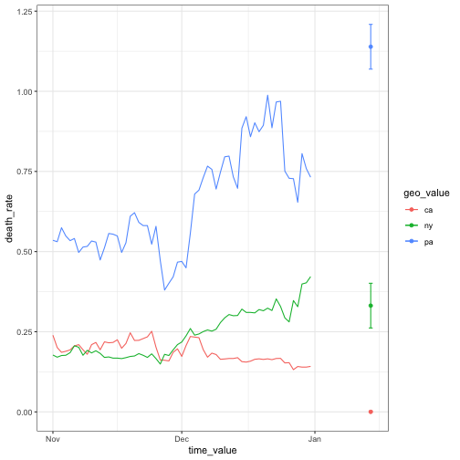

```r
# remotes::install_github("cmu-delphi/epipredict")
library(epipredict)
library(ggplot2)
library(dplyr)
library(tidyr)
library(recipes)
library(parsnip)
library(workflows)
dat <- case_death_rate_subset %>% # 1 year of daily data, 56 locations
  filter(time_value >= "2021-11-01", geo_value %in% c("ca", "ny", "pa"))
dat
```

```
## An `epi_df` object, 183 x 4 with metadata:
## * geo_type  = state
## * time_type = day
## * as_of     = 2022-05-31 12:08:25
## 
## # A tibble: 183 × 4
##    geo_value time_value case_rate death_rate
##  * <chr>     <date>         <dbl>      <dbl>
##  1 ca        2021-11-01      15.6      0.239
##  2 ny        2021-11-01      19.9      0.177
##  3 pa        2021-11-01      30.6      0.535
##  4 ca        2021-11-02      15.5      0.201
##  5 ny        2021-11-02      20.3      0.171
##  6 pa        2021-11-02      30.6      0.531
##  7 ca        2021-11-03      15.4      0.186
##  8 ny        2021-11-03      20.2      0.176
##  9 pa        2021-11-03      30.1      0.574
## 10 ca        2021-11-04      15.7      0.189
## # … with 173 more rows
```

```r
# Now, 3 states for 61 days as a "long" data frame
# This data happens to be "regular" since it was revised 5 months later.
# But it typically would not be. For example, some states didn't report on
# Christmas / New Years, those values becoming available only much later.

# Very simple task:
# Predict `death_rate` at h = 2 weeks after the last available time_value
# Use lags of `case_rate` and `death_rate` as features
# We'll use
#   death_rate lags of 0 (today), 7, 14 days
#   case_rate lags of 0, 1, 2, 3, 7, 14 days
# We also want uncertainty bands around the forecasts.
# A "simple", nonparametric version uses quantiles of the training residuals
# (Yes, this is problematic for many reasons, but isn't obviously terrible
# in practice. And it illustrates post-processing.)

r <- epi_recipe(dat) %>%
  step_epi_lag(case_rate, lag = c(0, 1, 2, 3, 7, 14)) %>%
  step_epi_lag(death_rate, lag = c(0, 7, 14)) %>%
  step_epi_ahead(death_rate, ahead = 14) %>%
  recipes::step_naomit(all_predictors(), skip = FALSE) %>%
  recipes::step_naomit(all_outcomes(), skip = TRUE)

# epi_recipe knows how to handle the time_value and geo_value, and keeps them
# around to label predictions eventually.
#
# step_epi_* performs lag/lead via modifications to the time_value and
# join operations rather than shifting the vectors and "hoping"
r
```

```
## Recipe
## 
## Inputs:
## 
##        role #variables
##   geo_value          1
##         raw          2
##  time_value          1
## 
## Operations:
## 
## Lagging case_rate by 0, 1, 2, 3, 7, 14
## Lagging death_rate by 0, 7, 14
## Leading death_rate by 14
## Removing rows with NA values in all_predictors()
## Removing rows with NA values in all_outcomes()
```

```r
# time_value and geo_value are always given roles, any additional "key"
# variables will be given the role="key". Data columns are assigned the role
# "raw" since they are unlikely to be predictors/outcomes by default
r %>% prep() %>% bake(dat)
```

```
## # A tibble: 141 × 14
##    time_value geo_value case_rate death…¹ lag_0…² lag_1…³ lag_2…⁴ lag_3…⁵ lag_7…⁶
##    <date>     <chr>         <dbl>   <dbl>   <dbl>   <dbl>   <dbl>   <dbl>   <dbl>
##  1 2021-11-15 ca             13.0   0.217    13.0    14.0    16.1    15.7    15.6
##  2 2021-11-15 ny             28.5   0.168    28.5    27.5    27.2    26.2    22.0
##  3 2021-11-15 pa             38.9   0.554    38.9    38.9    38.0    37.2    33.6
##  4 2021-11-16 ca             13.2   0.225    13.2    13.0    14.0    16.1    15.7
##  5 2021-11-16 ny             29.1   0.168    29.1    28.5    27.5    27.2    22.9
##  6 2021-11-16 pa             40.8   0.549    40.8    38.9    38.9    38.0    34.0
##  7 2021-11-17 ca             13.3   0.198    13.3    13.2    13.0    14.0    15.5
##  8 2021-11-17 ny             29.8   0.166    29.8    29.1    28.5    27.5    23.7
##  9 2021-11-17 pa             41.6   0.497    41.6    40.8    38.9    38.9    35.3
## 10 2021-11-18 ca             14.5   0.213    14.5    13.3    13.2    13.0    13.3
## # … with 131 more rows, 5 more variables: lag_14_case_rate <dbl>,
## #   lag_0_death_rate <dbl>, lag_7_death_rate <dbl>, lag_14_death_rate <dbl>,
## #   ahead_14_death_rate <dbl>, and abbreviated variable names ¹​death_rate,
## #   ²​lag_0_case_rate, ³​lag_1_case_rate, ⁴​lag_2_case_rate, ⁵​lag_3_case_rate,
## #   ⁶​lag_7_case_rate
```

```r
# our post-processor, taking the prep/bake analogy to its logical extreme
# it's possible you would do something to the model before making predictions
# so we add a prediction layer
f <- frosting() %>%
  layer_predict() %>%
  layer_residual_quantiles(probs = c(.1, .9), symmetrize = TRUE) %>%
  layer_threshold(starts_with(".pred"), lower = 0) %>%
  # predictions/intervals should be non-negative
  layer_add_target_date(target_date = max(dat$time_value) + 14)
f
```

```
## 4 Frosting Layers
## 
## • layer_predict()
## • layer_residual_quantiles()
## • layer_threshold()
## • layer_add_target_date()
```

```r
ewf <- epi_workflow(r, linear_reg(), f)
ewf
```

```
## ══ Epi Workflow ═════════════════════════════════════════════════════════════════
## Preprocessor: Recipe
## Model: linear_reg()
## Postprocessor: Frosting
## 
## ── Preprocessor ─────────────────────────────────────────────────────────────────
## 5 Recipe Steps
## 
## • step_epi_lag()
## • step_epi_lag()
## • step_epi_ahead()
## • step_naomit()
## • step_naomit()
## 
## ── Model ────────────────────────────────────────────────────────────────────────
## Linear Regression Model Specification (regression)
## 
## Computational engine: lm 
## 
## ── Postprocessor ────────────────────────────────────────────────────────────────
## 4 Frosting Layers
## 
## • layer_predict()
## • layer_residual_quantiles()
## • layer_threshold()
## • layer_add_target_date()
```

```r
trained_ewf <- ewf %>% fit(dat)

# examines the recipe to determine what data is required to make the prediction
# Note: it should NOT be affected by the leading step, or we'll lose
# valuable recent data
latest <- get_test_data(r, dat)
preds <- trained_ewf %>% predict(new_data = latest)
preds
```

```
## An `epi_df` object, 3 x 5 with metadata:
## * geo_type  = state
## * time_type = day
## * as_of     = 2022-05-31 12:08:25
## 
## # A tibble: 3 × 5
##   geo_value time_value .pred       .pred_distn target_date
##   <chr>     <date>     <dbl>            <dist> <date>     
## 1 ca        2021-12-31 0     [0.1, 0.9]<q-rng> 2022-01-14 
## 2 ny        2021-12-31 0.331 [0.1, 0.9]<q-rng> 2022-01-14 
## 3 pa        2021-12-31 1.14  [0.1, 0.9]<q-rng> 2022-01-14
```

```r
# just for fun, we examine these forecasts
ggplot(dat, aes(colour = geo_value)) +
  geom_line(aes(time_value, death_rate)) +
  geom_point(data = preds, aes(x = target_date, y = .pred)) +
  geom_errorbar(
    data = preds %>%
      mutate(q = nested_quantiles(.pred_distn)) %>%
      unnest(q) %>%
      pivot_wider(names_from = tau, values_from = q),
    aes(x = target_date, ymin = `0.1`, ymax = `0.9`)
  ) +
  theme_bw()
```



```r
sessionInfo()
```

```
## R version 4.2.2 (2022-10-31)
## Platform: aarch64-apple-darwin20 (64-bit)
## Running under: macOS Ventura 13.1
## 
## Matrix products: default
## LAPACK: /Library/Frameworks/R.framework/Versions/4.2-arm64/Resources/lib/libRlapack.dylib
## 
## locale:
## [1] en_US.UTF-8/en_US.UTF-8/en_US.UTF-8/C/en_US.UTF-8/en_US.UTF-8
## 
## attached base packages:
## [1] stats     graphics  grDevices utils     datasets  methods   base     
## 
## other attached packages:
##  [1] workflows_1.1.2       recipes_1.0.4.9000    forcats_1.0.0        
##  [4] stringr_1.5.0         dplyr_1.1.0           purrr_1.0.1          
##  [7] readr_2.1.3           tidyr_1.3.0           tibble_3.1.8         
## [10] ggplot2_3.4.0         tidyverse_1.3.2       epipredict_0.0.3     
## [13] parsnip_1.0.3         epiprocess_0.5.0.9999
## 
## loaded via a namespace (and not attached):
##   [1] googledrive_2.0.0    colorspace_2.1-0     ellipsis_0.3.2      
##   [4] class_7.3-20         rsconnect_0.8.29     markdown_1.4        
##   [7] fs_1.6.0             rstudioapi_0.14      listenv_0.9.0       
##  [10] farver_2.1.1         MatrixModels_0.5-1   remotes_2.4.2       
##  [13] prodlim_2019.11.13   fansi_1.0.4          lubridate_1.9.1     
##  [16] xml2_1.3.3           R.methodsS3_1.8.2    codetools_0.2-18    
##  [19] splines_4.2.2        cachem_1.0.6         knitr_1.41          
##  [22] pkgload_1.3.2        jsonlite_1.8.4       broom_1.0.2         
##  [25] anytime_0.3.9        dbplyr_2.3.0         R.oo_1.25.0         
##  [28] shiny_1.7.4          clipr_0.8.0          compiler_4.2.2      
##  [31] httr_1.4.4           backports_1.4.1      assertthat_0.2.1    
##  [34] Matrix_1.5-3         fastmap_1.1.0        gargle_1.2.1        
##  [37] cli_3.6.0            later_1.3.0          htmltools_0.5.4     
##  [40] quantreg_5.94        prettyunits_1.1.1    tools_4.2.2         
##  [43] gtable_0.3.1         glue_1.6.2           Rcpp_1.0.10.2       
##  [46] jquerylib_0.1.4      styler_1.9.0         cellranger_1.1.0    
##  [49] vctrs_0.5.2          timeDate_4022.108    xfun_0.36           
##  [52] gower_1.0.1          globals_0.16.2       ps_1.7.2            
##  [55] rvest_1.0.3          timechange_0.2.0     mime_0.12           
##  [58] miniUI_0.1.1.1       lifecycle_1.0.3      devtools_2.4.5      
##  [61] googlesheets4_1.0.1  future_1.30.0        tsibble_1.1.3       
##  [64] MASS_7.3-58.1        scales_1.2.1         ipred_0.9-13        
##  [67] hms_1.1.2            promises_1.2.0.1     parallel_4.2.2      
##  [70] SparseM_1.81         yaml_2.3.6           memoise_2.0.1       
##  [73] sass_0.4.4           rpart_4.1.19         stringi_1.7.12      
##  [76] highr_0.10           hardhat_1.2.0        pkgbuild_1.4.0      
##  [79] lava_1.7.1           commonmark_1.8.1     rlang_1.0.6         
##  [82] pkgconfig_2.0.3      distributional_0.3.1 evaluate_0.20       
##  [85] lattice_0.20-45      htmlwidgets_1.6.1    labeling_0.4.2      
##  [88] processx_3.8.0       tidyselect_1.2.0     parallelly_1.34.0   
##  [91] magrittr_2.0.3       R6_2.5.1             generics_0.1.3      
##  [94] profvis_0.3.7        DBI_1.1.3            pillar_1.8.1        
##  [97] haven_2.5.1          withr_2.5.0          survival_3.5-0      
## [100] nnet_7.3-18          future.apply_1.10.0  modelr_0.1.10       
## [103] crayon_1.5.2         utf8_1.2.3           rmarkdown_2.20      
## [106] tzdb_0.3.0           urlchecker_1.0.1     usethis_2.1.6       
## [109] grid_4.2.2           readxl_1.4.1         data.table_1.14.6   
## [112] callr_3.7.3          reprex_2.0.2         digest_0.6.31       
## [115] R.cache_0.16.0       xtable_1.8-4         httpuv_1.6.8        
## [118] R.utils_2.12.2       munsell_0.5.0        bslib_0.4.2         
## [121] sessioninfo_1.2.2
```

